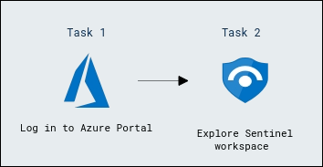
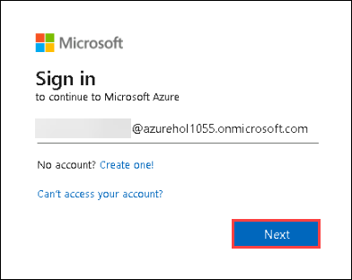
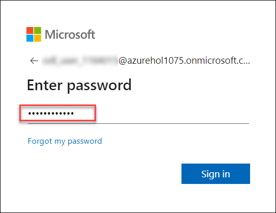
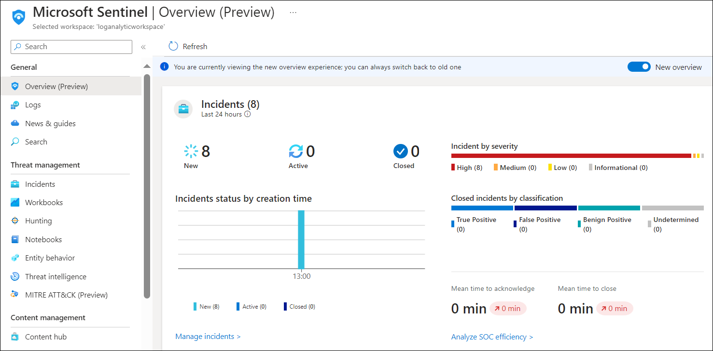
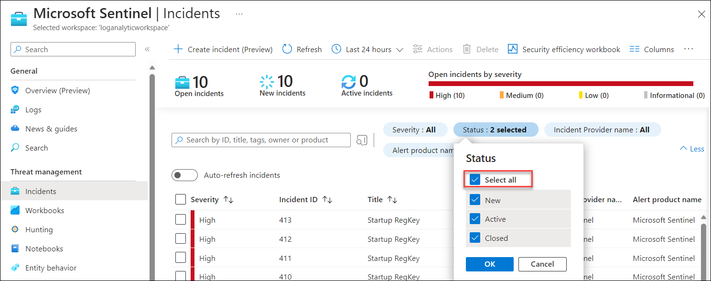
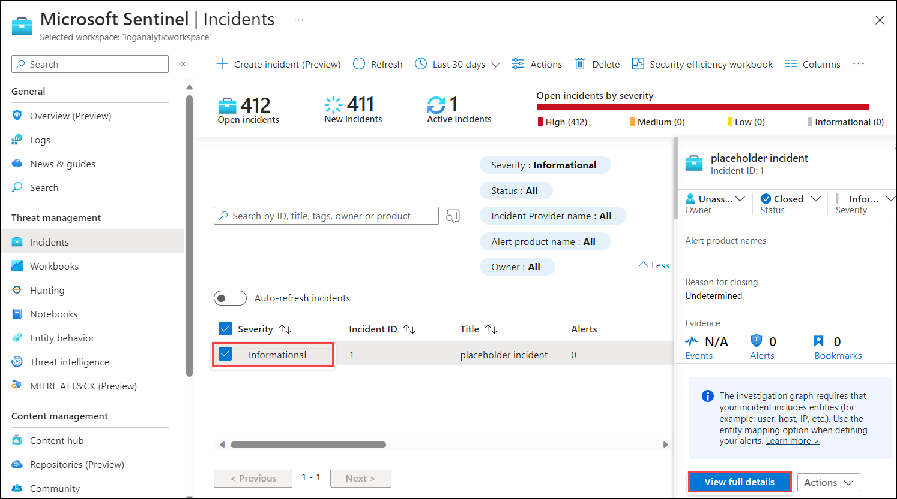

# Lab 01 - Review and explore sentinel workspace

## Lab scenario

In this lab, participants will explore a pre-configured Azure Sentinel workspace, investigating security incidents, configuring automated responses, and analyzing data to strengthen threat detection and response capabilities within the Azure environment.

You are a Security Operations Analyst working at a company that is implementing Microsoft Defender for Endpoint. Your manager plans to onboard a few devices to provide insight into required changes to the Security Operations (SecOps) team response procedures.
You start by initializing the Defender for the Endpoint environment. Next, you onboard the initial devices for your deployment by running the onboarding script on the devices.

## Lab objectives
 In this lab, you will perform the following:
 - Task 1: Log in to Azure Portal
 - Task 2: Explore Sentinel workspace

## Estimated timing: 30 minutes

## Architecture Diagram

  

## Exercise 1: Exploring a Pre-Created Azure Sentinel Workspace

### Task 1: Log in to Azure Portal

  In this task , you login to Azure Portal and allows you to manage and configure your cloud resources through a web-based interface.

1. If you are not login to the azure portal then in the virtual machine (VM) on the left, click on the Azure Portal, as shown below.

   
    
1. On the **Sign into Microsoft Azure** tab, you will see the login screen. Enter the following **Email/Username**, and then click on **Next**.

   * Email/Username: <inject key="AzureAdUserEmail"></inject>

     

1. Enter the following **Password** and click on **Sign in**. 
   
    * Password: <inject key="AzureAdUserPassword"></inject>

      

1. If you see the pop-up **Action Required**, click **Ask Later**.

           
    
1. First-time users are often prompted to Stay Signed In. If you see any such pop-up, click on No.
   
1. If a **Welcome to Microsoft Azure** popup window appears, click on Maybe Later to skip the tour.

### Task 2: Explore Sentinel workspace

 In this task, you will explore the Sentinel workspace to review and manage security data, alerts, and incident responses within Microsoft's Azure Sentinel.

1. In the Search bar of the Azure portal, type *Microsft Sentinel*, then select **Microsoft Sentinel**.

    

1. Select the pre-created Sentinel **loganalyticworkspace** from the available list.

     

1. Explore the **Overview** page to obtain a summary of the workspace, including information on incidents, alerts, health, and other essential details.

    

1. Navigate to the **Data connectors** under **configuration** section in the left sidebar and examine the currently configured connectors for collecting security-related data.

    

1. In the **threat management** section, choose **Incidents** from the left panel to assess detected security incidents and alerts.

1. Click on the status filter beside the search space, and then select the **Select all** checkbox to view all new, active, and closed incidents.

    

   >**Note**: If the **Status filter** option isn't visible, simply click on **More** to access it.

1. Select the **Informational** incident from the list to view details and take necessary actions.

    

    <validation step="08faf6a7-9700-4ffa-85a4-de53afb85777" />

    > **Congratulations** on completing the task! Now, it's time to validate it. Here are the steps:
    > - Hit the Validate button for the corresponding task.
    > - If you receive a success message, you can proceed to the next task. If not, carefully read the error message and retry the step, following the instructions in the lab guide.
    > - If you need any assistance, please contact us at labs-support@spektrasystems.com. We are available 24/7 to help you out.

## Review
In this lab you have completed the following tasks:
 - Log in to Azure Portal
 - Explore Sentinel workspace

### You've successfully completed this lab. Please proceed with the next lab.
