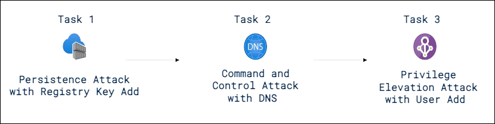
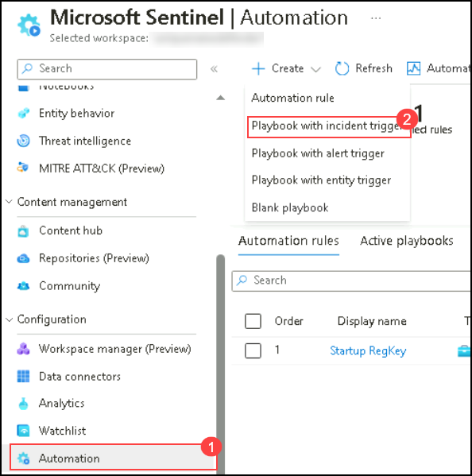
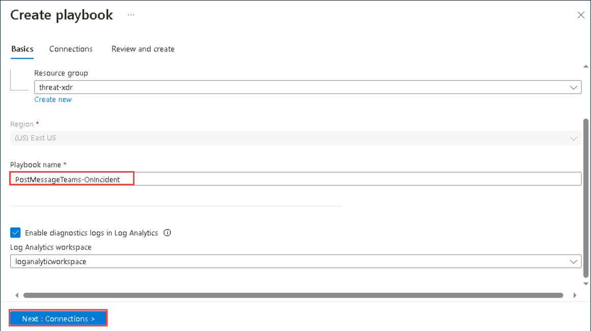

# Lab 01 - Conduct attacks

## Lab scenario

You are going to simulate the attacks that you will later use to detect and investigate in Microsoft Defender.

## Lab objectives
 In this lab, you will perform the following:
- Task 1: Connect the Windows security event connector
- Task 2: Enable Microsoft Defender for Cloud
- Task 3: Persistence Attack with Registry Key Add
- Task 4: Command and Control Attack with DNS
- Task 5: Privilege Elevation Attack with User Add

## Estimated timing: 90 minutes

## Architecture Diagram

  

### Task 1: Connect the Windows security event connector

1. In the Search bar of the Azure portal, type *Microsft Sentinel (1)*, then select **Microsoft Sentinel (2)**.

     

1. Select the pre-created Sentinel **loganalyticworkspace** from the available list.

     

1. Navigate to the left menu and go to the Content Management section; there, select **Content Hub (1)**. On the Content Hub page, locate **Windows Security Events (2)**, and then **Select (3)** it. Finally, click on **Install (4)**.

      

1. After receiving the notification of a successful installation, return to the **Data Connector** page and click on the **Refresh** button to ensure that the changes take effect.

1. You should observe two options: **Security Events Via Legacy Agent** and **Windows Security Event Via AMA**.

1. Choose **Security Events Via Legacy Agent**, and then click on **Open connector page**.

     
   
8. In the configuration section, opt for **Install agent on Azure Windows Virtual Machine (1)**, and then choose **Download & Install agent for Azure Windows Virtual machines > (2)**.

     

9. Select the **svm-<inject key="DeploymentID" enableCopy="false" />** virtual machine and click on **Connect**.

     
        
10. Once **Connected (1)**, select the **Virtual Machine (2)** link from the top.

     

11. On the virtual machine page select the **s2vm-<inject key="DeploymentID" enableCopy="false" />** virtual machine and click on **Connect**. wait until get connected.

    

11. Then, come back to the configuration and scroll down a bit. You can find **Select which events to stream**. Click on **All Events**. Click on **Apply changes** now. If you refresh the data connector page, you can see the status Connected for **Security Events Via Legacy Agent**.

     
    <validation step="5b4e3b82-5d93-486f-a17f-b62ff3a94dc4" />

    > **Congratulations** on completing the task! Now, it's time to validate it. Here are the steps:
    > - Click the Lab Validation tab located at the upper right corner of the lab guide section and navigate to the Lab Validation tab.
    > - Hit the Validate button for the corresponding task.
    > - If you receive a success message, you can proceed to the next task. If not, carefully read the error message and retry the step, following the instructions in the lab guide.
    > - If you need any assistance, please contact us at labs-support@spektrasystems.com. We are available 24/7 to help you out.


### Task 2: Enable Microsoft Defender for Cloud

In this task, you will enable and configure Microsoft Defender for Cloud.

1. In the search bar of the Azure portal, type *Microsoft Defender for cloud (1)*, then select **Microsoft Defender for Cloud (2)**.

     

1. Click the left menu, and then click on **Getting Started**.

1. On the **Getting Started** page, under the **Upgrade** tab, ensure your subscription is selected, and then click the **Upgrade** button at the bottom of the page.

    

    >**Note:** Please wait for 2-5 minutes for the process to complete, as it may take some time.

4. In the left menu for Microsoft Defender for Cloud, under Management, select **Environment settings**.

1. Click on the subscription (or its equivalent name in your language). 

1. Review the Azure resources that are now protected with the Defender for Cloud plans.

1. Select the **Settings & monitoring** tab from the Settings area (next to Save).
 
     

1. Review the monitoring extensions and confirm that **Log Analytics agent/Azure Monitor agent** is **On**.

     

1. Select the newly created **Log Analytics workspace** which will gather all security events data of the machines to analyze. Click on **Apply** and **Continue**. Click on **Save** for the changes to take effect.

   

1. Close the settings page by selecting the 'X' on the upper right of the page to return to the **Environment settings**. Then, click on the '>' to the left of your subscription.

1. Select the Log Analytics workspace named **loganalyticworkspace** to review the available options and pricing.

     

1. Select **Enable all plans** (to the right of Select Defender plan), and then choose **Save**. Wait for the *"Microsoft Defender plan for workspace loganalyticworkspace was saved successfully!"* notification to appear.

    >**Note:** If the page is not being displayed, refresh your Edge browser and try again.

1. Close the Defender plans page by selecting the 'X' in the upper right corner of the page to return to the **Environment settings**.

    

### Task 3: Persistence Attack with Registry Key Add 

>**Note:** Perform this task in your LAB-VM (svm).

1. In the search of the taskbar, enter *Command*. A Command Prompt will be displayed in the search results. Right-click on the Command Prompt and select **Run as Administrator**. Select **Yes** in the User Account Control window that allows the app to run.

1. In the Command Prompt, create a Temp folder in the root directory. Remember to press Enter after the last row:

    ```CommandPrompt
    cd \
    mkdir temp
    cd temp
    notepad startup.bat
    ```

   >**Note:** If you face any issues in creating the temp folder please check temp folder is already present or not if present please delete the temp folder and perform the above step again.
   
1. Select **Yes** to create a new file and **Save** the empty file.

1. Copy and run this command to simulate program persistence:

    ```CommandPrompt
    REG ADD "HKCU\SOFTWARE\Microsoft\Windows\CurrentVersion\Run" /V "SOC Test" /t REG_SZ /F /D "C:\temp\startup.bat"
    ```

### Task 4: Command and Control Attack with DNS

>**Note:** Perform this task in your LAB-VM (svm).

1. Copy and run this command to create a script that will simulate a DNS query to a C2 server:

    ```CommandPrompt
    notepad c2.ps1
    ```

1. Select **Yes** to create a new file and copy the following PowerShell script into *c2.ps1*.

    >**Note:** Pasting into the virtual machine file might not show the full script length. Make sure the script matches the instructions within the *c2.ps1* file.

    ```PowerShell
    param(
        [string]$Domain = "microsoft.com",
        [string]$Subdomain = "subdomain",
        [string]$Sub2domain = "sub2domain",
        [string]$Sub3domain = "sub3domain",
        [string]$QueryType = "TXT",
        [int]$C2Interval = 8,
        [int]$C2Jitter = 20,
        [int]$RunTime = 240
    )
    $RunStart = Get-Date
    $RunEnd = $RunStart.addminutes($RunTime)
    $x2 = 1
    $x3 = 1 
    Do {
        $TimeNow = Get-Date
        Resolve-DnsName -type $QueryType $Subdomain".$(Get-Random -Minimum 1 -Maximum 999999)."$Domain -QuickTimeout
        if ($x2 -eq 3 )
        {
            Resolve-DnsName -type $QueryType $Sub2domain".$(Get-Random -Minimum 1 -Maximum 999999)."$Domain -QuickTimeout
            $x2 = 1
        }
        else
        {
            $x2 = $x2 + 1
        }    
        if ($x3 -eq 7 )
        {
            Resolve-DnsName -type $QueryType $Sub3domain".$(Get-Random -Minimum 1 -Maximum 999999)."$Domain -QuickTimeout
            $x3 = 1
        }
        else
        {
            $x3 = $x3 + 1
        }
        $Jitter = ((Get-Random -Minimum -$C2Jitter -Maximum $C2Jitter) / 100 + 1) +$C2Interval
        Start-Sleep -Seconds $Jitter
    }
    Until ($TimeNow -ge $RunEnd)
    ```

1. In the Notepad menu, select **File** and then **Save**. 

1. Go back to the Command Prompt window, enter the following command and press Enter.

    ```CommandPrompt
    Start PowerShell.exe -file c2.ps1
    ```
    
    
   
    >**Note:** You will see DNS resolve errors. This is expected.

    >**Important**: Do not close these windows. Let this PowerShell script run in the background. The command needs to generate log entries for some hours. You can proceed to the next task and next exercises while this script runs. The data created by this task will be used in the Threat Hunting lab later. This process will not create substantial amounts of data or processing.

### Task 5: Privilege Elevation Attack with User Add

>**Important:** The next steps are done on a different machine than the one you were previously working on. Look for the Virtual Machine name references.

1. In Azure portal, Search for **Virtual machines (1)** and select **Virtual machines (2)**.

   

1. Select the virtual machine **s2vm-<inject key="DeploymentID" enableCopy="false" />** from the list.
   
   

1. At the beginning of the virtual machine page, click on **Connect**, and from the drop-down select **Connect**.

   

1. On the Connect to Virtual Machine page, select RDP, Choose the option to **Download RDP File.**

   > **Note**: If you see the popup on browser while downloading the file, please select the **keep** option to download the file. 

1. Open the downloaded RDP file from the downloads.

   

1. Select **Connect** when prompted. You will get a warning that the .rdp file is from an unknown publisher. This is expected. In the Remote Desktop Connection window, select Connect to continue.

   
   
1. In the Windows Security window, select More Choices and then Use a different account. Enter **Username:** <inject key="Labvm Admin Username"></inject> and **Password:** <inject key="Labvm Admin Password"></inject> and then select **OK**.

   

1. Select **Yes** to verify the identity of the virtual machine and finish logging on.

    

1. You should now be connected to the virtual machine via Remote Desktop.

1. In the search of the taskbar of your **s2vm-<inject key="DeploymentID" enableCopy="false" />** VM, enter *Command*. A Command Prompt will be displayed in the search results. Right-click on the Command Prompt and select **Run as Administrator**. Select **Yes** in the User Account Control window that allows the app to run.

1. In the Command Prompt, create a Temp folder in the root directory. Remember to press Enter after the last row:

    ```CommandPrompt
    cd \
    ```
    ```CommandPrompt
    mkdir temp
    ```
    ```CommandPrompt
    cd temp
    ```

   >**Note:** If you face any issues in creating the temp folder please check temp folder is already present or not if present please delete the temp folder and perform the above step again.

1. Copy and run this command to simulate the creation of an Admin account. Remember to press Enter after the last row:

    ```CommandPrompt
    net user theusernametoadd /add
    ```
    ```CommandPrompt
    net user theusernametoadd ThePassword1!
    ```
    ```CommandPrompt
    net localgroup administrators theusernametoadd /add
    ```

# Playbook Creation

In this task, you will create a playbook for next task.

1. In the Search bar of the Azure portal, type *Sentinel*, then select **Microsoft Sentinel**.

1. Select the Microsoft Sentinel Workspace you created earlier.

1. Select the **Automation** form the *Configuration* section.

   

1. Click on create and select **Playbook with incident trigger**.

1. Select the resource group and give  playbook name **PostMessageTeams-OnIncident**

   

1. Select Enable diagnostics logs in Log Analytics and select your workspace.

1. Click on Next: Connections, Review + Create  and Click on Create and continue to designer.

   > **Note**: We dont have to perform any action on logic app designer, please go back to your sentinel workspace and follow the next labguide.


## Review
In this lab you have completed the following tasks:
- Connect the Windows security event connector
- Enable Microsoft Defender for Cloud
- Persistence Attack with Registry Key Add
- Command and Control Attack with DNS
- Privilege Elevation Attack with User Add
