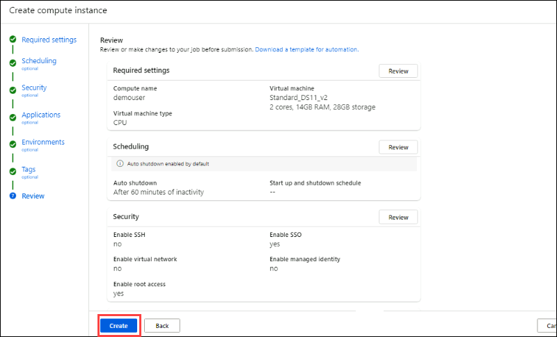

# Lab 01 - Threat Hunting using Notebooks with Microsoft Sentinel

## Lab scenario

You are a Security Operations Analyst working at a company that implemented Microsoft Sentinel. You have received threat intelligence about a Command and Control (C2 or C&C) technique.  You need to perform a hunt and watch for the threat.

## Lab objectives
 In this lab, you will perform the following:
 - Task 1: Connect the Windows security event connector
 - Task 2: Enable Microsoft Defender for Cloud
 - Task 3: Persistence Attack with Registry Key Add
 - Task 4: Command and Control Attack with DNS
 - Task 5: Privilege Elevation Attack with User Add
 - Task 6: Create a hunting query
 - Task 7: Create a NRT query rule
 - Task 8: Create a Search
 - Task 9: Explore Notebooks

## Estimated timing: 120 minutes

## Architecture Diagram

 

### Task 1: Connect the Windows security event connector

In this task, you'll configure the connector to ensure seamless log transmission and enhance your security monitoring capabilities.

1. In the Search bar of the Azure portal, type **Microsft Sentinel (1)**, then select **Microsoft Sentinel (2)**.

     

1. Select the pre-created Sentinel **loganalyticworkspace** from the available list.

     

1. Navigate to the **Data connectors (1)** tab under the Configuration section. Search for **windows security events (2)**, and then click on **Go to content hub (3)**.

    

1. In search bar **windows security events (1)** , Select **windows security events (2)**, Choose **Install**.

    

1. In the **Data connectors**, Scroll-down **Security events via legacy Agent** , choose **Open connector page**.

    
   
8. In the configuration section, opt for **Install agent on Azure Windows Virtual Machine (1)**, and then choose **Download & install agent for Azure Windows Virtual Machines (2)**.

     

9. Select the **svm-<inject key="DeploymentID" enableCopy="false" />** virtual machine and click on **Connect**.

     
        
10. Once **Connected (1)**, select the **Virtual Machine (2)** link from the top.

     

11. On the virtual machine page select the **s2vm-<inject key="DeploymentID" enableCopy="false" />** virtual machine. Then, click on **Connect** and wait until the connection is Connected.

    

11. Then, come back to the Configuration and scroll down a bit. You can find **2. Select which events to stream**. Click on **All Events** and Click on **Apply changes**.

     

12. If you refresh the data connector page, you can see the status Connected for **Security Events Via Legacy Agent**.

### Task 2: Enable Microsoft Defender for Cloud

In this task, you will enable and configure Microsoft Defender for Cloud.

1. In the search bar of the Azure portal, type **Microsoft Defender for Cloud (1)**, then select **Microsoft Defender for Cloud (2)**.

     

1. Click the left menu, and then click on **Getting Started**.

1. On the **Getting started** page, under the **Upgrade** tab, ensure your subscription is selected, and then click the **Upgrade** button at the bottom of the page. Please wait for 2-5 minutes for the process to complete, as it may take some time.

    

   > **Note**: If you face some errors while upgrading the plan, please ignore them and proceed with the next step.

4. In the left menu for Microsoft Defender for Cloud, under Management, select **Environment settings**.

1. Click on the subscription (or its equivalent name in your language). 

1. Review the Azure resources that are now protected with the Defender for Cloud plans.

1. Select the **Settings & monitoring** tab from the Settings area (next to Save).
 
     

1. Check that the **Log Analytics agent/Azure Monitor agent** is turned **On**. Then, click Continue or close the Settings & Monitoring page by selecting the 'X' in the upper right corner.

     

1. Choose the newly created Log Analytics workspace to collect all security event data from the machines for analysis. Click **Apply** and then **Continue**. Finally, click **Save** to apply the changes. 

   

1. Close the settings page by selecting the 'X' on the upper right of the page.

### Task 3: Persistence Attack with Registry Key Add 

 In this task, you'll analyze how attackers leverage registry keys to establish persistence and explore methods to detect and mitigate such threats.

>**Note:** Perform this task in your LAB-VM (svm).

1. In the taskbar search, type Command. Right-click on Command Prompt in the results and choose **Run as Administrator**. Click **Yes** in the User Account Control window.

1. In the Command Prompt, create a temp folder in the root directory by entering the following commands and pressing Enter after each line:

    ```CommandPrompt
    cd \
    mkdir temp
    cd temp
    ```
    
   >**Note:** If you face any issues in creating the temp folder please check whether the temp folder is already present or not if present please delete the temp folder and perform the above step again.

1. Copy and run this command to simulate program persistence:

    ```CommandPrompt
    REG ADD "HKCU\SOFTWARE\Microsoft\Windows\CurrentVersion\Run" /V "SOC Test" /t REG_SZ /F /D "C:\temp\startup.bat"
    ```

### Task 4: Command and Control Attack with DNS

In this task, you'll investigate how attackers utilize DNS for C2 communications and learn to identify and mitigate these threats effectively.

>**Note:** Perform this task in your LAB-VM (svm).

1. Copy and run this command to create a script that will simulate a DNS query to a C2 server:

    ```CommandPrompt
    notepad c2.ps1
    ```

1. Select **Yes** to create a new file and copy the following PowerShell script into *c2.ps1*.

    >**Note:** When pasting into the virtual machine file, the full script length might not be visible. Ensure that the script matches the instructions in the c2.ps1 file.

    ```PowerShell
    param(
        [string]$Domain = "microsoft.com",
        [string]$Subdomain = "subdomain",
        [string]$Sub2domain = "sub2domain",
        [string]$Sub3domain = "sub3domain",
        [string]$QueryType = "TXT",
        [int]$C2Interval = 8,
        [int]$C2Jitter = 20,
        [int]$RunTime = 240
    )
    $RunStart = Get-Date
    $RunEnd = $RunStart.addminutes($RunTime)
    $x2 = 1
    $x3 = 1 
    Do {
        $TimeNow = Get-Date
        Resolve-DnsName -type $QueryType $Subdomain".$(Get-Random -Minimum 1 -Maximum 999999)."$Domain -QuickTimeout
        if ($x2 -eq 3 )
        {
            Resolve-DnsName -type $QueryType $Sub2domain".$(Get-Random -Minimum 1 -Maximum 999999)."$Domain -QuickTimeout
            $x2 = 1
        }
        else
        {
            $x2 = $x2 + 1
        }    
        if ($x3 -eq 7 )
        {
            Resolve-DnsName -type $QueryType $Sub3domain".$(Get-Random -Minimum 1 -Maximum 999999)."$Domain -QuickTimeout
            $x3 = 1
        }
        else
        {
            $x3 = $x3 + 1
        }
        $Jitter = ((Get-Random -Minimum -$C2Jitter -Maximum $C2Jitter) / 100 + 1) +$C2Interval
        Start-Sleep -Seconds $Jitter
    }
    Until ($TimeNow -ge $RunEnd)
    ```

1. In the Notepad menu, select **File** and then **Save**. 

1. Go back to the Command Prompt window, enter the following command and press Enter.

    ```CommandPrompt
    Start PowerShell.exe -file c2.ps1
    ```
    
    
   
    >**Note:** You will see DNS resolve errors. This is expected.

    >**Important**: Keep these windows open and let the PowerShell script run in the background. It needs to generate log entries for several hours. You can proceed with the next task and exercises while the script runs. The data generated will be used later in the Threat Hunting lab. This process will not significantly impact data or processing.

### Task 5: Privilege Elevation Attack with User Add

In this task, you'll examine the techniques used in such attacks and develop strategies to detect and prevent unauthorized user account creation.

>**Important:** The next steps are done on a different machine than the one you were previously working on. Look for the Virtual Machine name references.

1. In Azure portal, Search for **Virtual machines (1)** and select **Virtual machines (2)**.

   

1. Select the virtual machine **s2vm-<inject key="DeploymentID" enableCopy="false" />** from the list.
   
   

1. At the beginning of the virtual machine page, click on **Connect**, and from the drop-down select **Connect**.

   

1. On the Connect to Virtual Machine page, select RDP, Choose the option to **Download RDP File.**

   

1. Open the downloaded RDP file from the downloads.

   

1. Select Connect when prompted. You will get a warning that the .rdp file is from an unknown publisher. This is expected. In the Remote Desktop Connection window, select **Connect** to continue.

   
   
1. In the Windows Security window, select More Choices and then Use a different account. Enter **Username:** <inject key="Labvm Admin Username"></inject> and **Password:** <inject key="Labvm Admin Password"></inject> and then select **OK**.

   

1. Select **Yes** to verify the identity of the virtual machine and finish logging on.

    

1. You should now be connected to the virtual machine via Remote Desktop.

1. In the taskbar search, type Command. Right-click on Command Prompt in the results and choose **Run as Administrator**. Click **Yes** in the User Account Control window.

1. In the Command Prompt, create a Temp folder in the root directory. Remember to press Enter after the last row:

    ```CommandPrompt
    cd \
    ```
    ```CommandPrompt
    mkdir temp
    ```
    ```CommandPrompt
    cd temp
    ```

   >**Note:** If you face any issues in creating the temp folder please check whether the temp folder is already present or not if present please delete the temp folder and perform the above step again.

1. Copy and run this command to simulate the creation of an Admin account. Remember to press Enter after the last row:

    ```CommandPrompt
    net user theusernametoadd /add
    ```
    ```CommandPrompt
    net user theusernametoadd ThePassword1!
    ```
    ```CommandPrompt
    net localgroup administrators theusernametoadd /add
    ```

### Task 6: Create a hunting query

In this task, you will create a hunting query, bookmark a result, and create a Livestream.

1. In the Search bar of the Azure portal, type Sentinel, then select **Microsoft Sentinel**.

1. Select your Microsoft Sentinel Workspace.

1. Select **Logs** under the General section from the left menu.

1. Enter the following KQL Statement in the New Query 1 space:

   >**Important:** Please paste any KQL queries first in Notepad and then copy from there to the New Query 1 Log window to avoid any errors.

    ```KQL
    let lookback = 2d; 
    SecurityEvent 
    | where TimeGenerated >= ago(lookback) 
    | where EventID == 4688 and Process =~ "powershell.exe"
    | extend PwshParam = trim(@"[^/\\]*powershell(.exe)+" , CommandLine) 
    | project TimeGenerated, Computer, SubjectUserName, PwshParam 
    | summarize min(TimeGenerated), count() by Computer, SubjectUserName, PwshParam 
    | order by count_ desc nulls last 
    ```

1. Review the different results. You have now identified PowerShell requests that are running in your environment.

    

1. Select the checkbox of the results that shows the **demouser** SubjectUsername but in some cases the SubjectUsername is in the default form like **svm-xxxxxx$** then select that as it is based on labvm name.

1. In the middle command bar, select the **Add bookmark** button.

   

1. Select **+ Add new entity** under Entity mapping.

1. For *Entity* select **Host**, then **Hostname** and **Computer** for the values.

1. For Tactics and Techniques, select **Command and Control**.

1. Go back to the Add bookmark blade, and select **Create**. We will map this bookmark to an incident later.

   .png)

1. Close the Logs window by selecting the **X** in the top-right of the window and select **OK** to discard the changes. 

1. Select your Microsoft Sentinel workspace again and select the **Hunting** page under the Threat Management area.

1. Select the **Queries (1)** tab and then **+ New query (2)** from the command bar.

   

1. In the Create hunting query window, for the *Name* enter **PowerShell Hunt**.

1. For the Custom query enter the following KQL statement:

    ```KQL
    let lookback = 2d; 
    SecurityEvent 
    | where TimeGenerated >= ago(lookback) 
    | where EventID == 4688 and Process =~ "powershell.exe"
    | extend PwshParam = trim(@"[^/\\]*powershell(.exe)+" , CommandLine) 
    | project TimeGenerated, Computer, SubjectUserName, PwshParam 
    | summarize min(TimeGenerated), count() by Computer, SubjectUserName, PwshParam 
    | order by count_ desc nulls last 
    ```
1. Scroll down and under *Entity mapping* select:
   
    - Select **+ Add new entity** under *Entity mapping*.
    - For the *Entity type* drop-down list select **Host**.
    - For the *Identifier* drop-down list select **HostName**.
    - For the *Value* drop-down list select **Computer**.

1. Scroll down and under *Tactics & Techniques* select **Command and Control** and then select **Create** to create the hunting query.

    .png)

1. In the Microsoft Sentinel - Hunting blade, search for the query you just created in the list, PowerShell Hunt.

1. Select **PowerShell Hunt** from the list.

1. Select the **View Results** button from the right pane. The KQL query will automatically run.

   

1. Close the *Logs* window by selecting the **X** in the top-right of the window and select **OK** to discard the changes. 

1. Right-click the **PowerShell Hunt** query and select **Add to livestream**.

   >**Hint:** This also can be done by sliding right and selecting the ellipsis **(...)** at the end of the row to open a context menu.

   

1. Review that the *Status* is now *Running*. This will be running every 30 seconds in the background, and you will receive a notification in the Azure Portal (bell icon) when a new result is found.

1. Select the **Bookmarks** tab in the middle pane.

1. Select the bookmark you just created from the results list.

1. On the right pane, scroll down and select the **Investigate** button. 

   >**Hint:** It might take a couple of minutes to show the investigation graph.

   

1. Explore the Investigation graph. Notice the high number of *Related alerts* for *svm-<inject key="DeploymentID" enableCopy="false" />*.

1. Close the *Investigation* graph window by selecting the **X** in the top-right of the window. 

1. Hide the right blade by selecting the **>>** icon and then scroll right until you see the ellipsis **(...)** icon.

1. Select **Add to existing incident**. This will display all the incidents in the right pane.

    

1. Select one of the incidents and then select **Add**. 

     

1. Scroll left to notice that the *Severity* column is now populated with the incident's data.

### Task 7: Create a NRT query rule

In this task, instead of using a LiveStream, you will create a NRT analytics query rule. NRT rules run every minute and look back one minute. The benefit of NRT rules is they can use the alert and incident creation logic.

1. In Microsoft Sentinel, on the left menu bar under the Configuration section, select **Analytics**, and then click on **+ Create** to choose **NRT query rule** from the dropdown.

     

1. This starts the Analytics rule wizard For the General tab type:

    |Setting|Value|
    |---|---|
    |Name|**NRT PowerShell Hunt**|
    |Description|**NRT PowerShell Hunt**|
    |Severity|**High**|
    |MITRE ATT&CK|**Command and Control**|

1. Status **Enabled**

1. Select **Next: Set rule logic >** button. 

1. For the *Rule query* enter the following KQL statement:

    ```KQL
    let lookback = 2d; 
    SecurityEvent 
    | where TimeGenerated >= ago(lookback) 
    | where EventID == 4688 and Process =~ "powershell.exe"
    | extend PwshParam = trim(@"[^/\\]*powershell(.exe)+" , CommandLine) 
    | project TimeGenerated, Computer, SubjectUserName, PwshParam 
    | summarize min(TimeGenerated), count() by Computer, SubjectUserName, PwshParam
    ```
    
1. Select **View query results >** to make sure your query does not have any errors.

1. Close the Logs window by selecting the **X** in the top-right of the window and select **OK** to discard the changes. 

1. Under Entity mapping select:
     
    - Select **+ Add new entity** under Entity mapping.
    - For the Entity type drop-down list select **Host**.
    - For the Identifier drop-down list select **HostName**.
    - For the Value drop-down list select **Computer**.

    

1. Scroll down and select **Next: Incident settings>** button.

1. For the *Incident settings* tab, leave the default values and select **Next: Automated response>** button.

1. For the Automated response tab, leave the default values and select **Next: Review and create >** button.

1. On the Review and Create tab, select the **Save** button to create and save the new Scheduled Analytics rule.

### Task 8: Create a Search job

In this task, you will use a Search job to look for a C2.

1. In Microsoft Sentinel, on the left menu under General, select the **Search**. In the search box, enter **reg.exe**, and then click on **Start**.

    

1. A new window running the query opens. Select the ellipsis icon **(...)** from the top right and then toggle the **Search job mode**.

1. Select **Search job** button and **enable** from the command bar. 

1. The search job creates a new table with your results as soon as they arrive. The results can be consulted from the *Saved Searches* tab.

1. Close the *Logs* window by selecting the **X** in the top-right of the window and select **OK** to discard the changes.
 
### Task 9: Explore Notebooks

In this task, you will explore using notebooks in Microsoft Sentinel.

1. In the Microsoft Sentinel Workspace, select **Notebooks** under the *Threat management* area.

1. Next, you need to create an AzureML Workspace. Select **Configure Azure Machine Learning** and then select the **Create new Azure ML workspace** button in the command bar.

     

1. In the Subscription box, select your subscription.

1. Select **Create new** for the Resource group and enter **RG-MachineLearning** for the Name and select **OK**. 

1. In the Workspace details section do the following:

     - Give your workspace a unique name.
     - Leave **East US** as the default value for *Region*.
     - Keep the default Storage account, Key vault, and Application insights information.
     - The Container registry option can remain as **None**.

1. At the bottom of the page, select **Review + Create**. When you see the *"Validation passed"* message, select **Create**. 

     >**Note:** It may take a few minutes to deploy the Machine Learning workspace.

1. After the *Your deployment is complete* message appears, return to the Microsoft Sentinel portal.

1. Select **Notebooks** again and then select the **Templates** tab from the middle command bar.

1. Select **A Getting Started Guide for Microsoft Sentinel** ML Notebooks.

   >**Note:** If you face any issues or do not see any popup after clicking on opening the **A Getting Started Guide for Microsoft Sentinel**. please select the **MyNotebooks** Tab beside the Notebook tab and click on the Notebook( the Azure ML Workspace you created earlier) this might be named as **Untitled** then start performing the lab from the lab guide step **13**.

1. On the right pane, scroll down and select **Create from template** button. Review the default options and then select **Save**.

    

1. Once the saving is done, select the **Launch notebook** button. This will take you to the Microsoft Azure Machine Learning Studio.

     
   
1. Select **X** if an informational window appears in the Microsoft Azure Machine Learning Studio.

1. In the command bar, to the right of the **Compute instance:**  selector, select the **+New** to create a new Azure ML Compute Instance.

      


    >**Note:** You can have more screen space by hiding the Azure ML Studio left blade by selecting the 3 lines on the top left, as well as the Notebooks Files by selecting the **<<** icon.

1. Type a unique name in the *Compute name* field. This will identify your compute instance.

1. Scroll down and select the first Compute Size option available from **D family**.

    
   
1. Select the **Create** button at the bottom of the screen. Close any feedback window that may appear. This will take a few minutes; you will see a notification (bell icon) when it is done and the *Compute instance* left icon turns from blue to green.

    
   
1. Once the Compute has been created and running, verify that the kernel to use is *Python 3.8 - AzureML*. 

   >**Hint:** This is shown on the right of the command bar.

1. Clear all the results from the notebook by selecting the **Clear all outputs** from the command bar and following the *Getting Started* tutorial. 

   >**Hint:** This can be found by selecting the ellipsis (...) from the command bar.
   
   >**Note:** If you cannot complete the steps above to access the Notebook, you can follow it on its GitHub viewer page instead. [Getting Started with Azure ML Notebooks and Microsoft Sentinel](https://nbviewer.org/github/Azure/Azure-Sentinel-Notebooks/blob/master/A%20Getting%20Started%20Guide%20For%20Azure%20Sentinel%20ML%20Notebooks.ipynb)

    <validation step="45086f11-29f0-4daa-ae93-6cd87c02fee4" />

   > **Congratulations** on completing the task! Now, it's time to validate it. Here are the steps:
    > - Click the Lab Validation tab located at the upper right corner of the lab guide section and navigate to the Lab Validation tab.
    > - Hit the Validate button for the corresponding task.
    > - If you receive a success message, you can proceed to the next task. If not, carefully read the error message and retry the step, following the instructions in the lab guide.
    > - If you need any assistance, please contact us at labs-support@spektrasystems.com. We are available 24/7 to help you out.

## Review
In this lab, you have completed the following tasks:
- Connect the Windows security event connector
- Enable Microsoft Defender for Cloud
- Persistence Attack with Registry Key Add
- Command and Control Attack with DNS
- Privilege Elevation Attack with User Add
- We created a hunting query.
- We created an NRT query rule.
- We Created a Search.
- Explore Notebooks
