# Lab 01 - Mitigate threats using Microsoft 365 Defender 

## Lab scenario

You're a Security Operations Analyst working at a company that implemented Microsoft Defender XDR solutions. You need to see the alerts in an incident to see the incident's full impact do a root cause investigation and mitigate these alerts using M365 Defender tools.

## Lab objectives
 In this lab, you will perform the following in the M365 Defender portal:
- Task 1: Onboard a Device 
- Task 2: Manage Incidents
- Task 3: Investigate Alerts

## Estimated timing: 60 minutes

## Architecture Diagram

 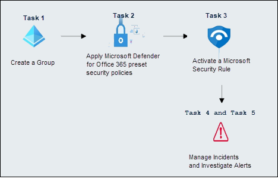

### Task 1: Onboard a Device

In this task, you will onboard a device to Microsoft Defender for Endpoint using an onboarding script.

1. If you are not already at the Microsoft 365 Defender portal in your browser, start the Microsoft Edge browser go to (https://security.microsoft.com).

1. On the **Sign into Microsoft Azure** tab, you will see the login screen. Enter the following **Email/Username**, and then click on **Next**.

   * Email/Username: <inject key="AzureAdUserEmail"></inject>

     

1. Enter the following **Password** and click on **Sign in**. 
   
   * Password: <inject key="AzureAdUserPassword"></inject>

      

    >**Note:** Take a moment to allow the option panel to fully load on the security portal.

1. Navigate to **Settings** in the left menu bar, and then, on the Settings page, choose **Endpoints**.

    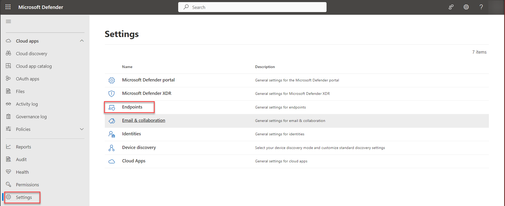

   >**Note:** If you do not see the **Endpoints** option under Settings, log out by selecting the top-right circle with your account initials and select Sign out. Other options that you might want to try are to refresh the page with Ctrl+F5 wait for 30-45 minutes or open the page InPrivate. Login again with the Tenant Email credentials.

1. Navigate to the **Onboarding** option in the Device Management section.

    >**Note:** Device onboarding can also be initiated from the **Assets** section on the left menu bar. Expand 'Assets' and choose 'Devices.' On the Device Inventory page, with 'Computers & Mobile' selected, scroll down to find the option for **Onboard devices.** Clicking on this option will direct you to the **Settings > Endpoints** page.

1. In the '1. Onboard a device' section, ensure that 'Local Script (for up to 10 devices)' is visible in the Deployment method drop-down, then click the **Download onboarding package** button.

    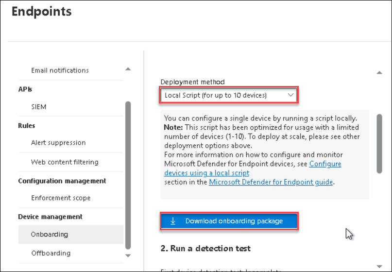 

1. In the *Downloads* pop-up, use your mouse to select the 'WindowsDefenderATPOnboardingPackage.zip' file, and then click on the folder icon for **Show in folder**. **Hint:** If you can't locate it, the file should be in the 'c:\users\admin\downloads' directory.

    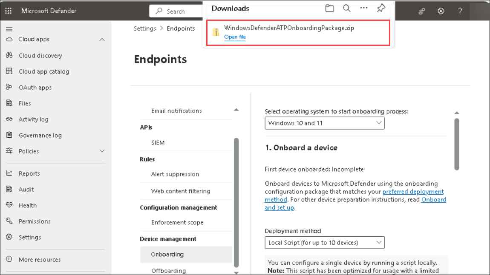

1. Right-click on the downloaded zip file, choose **Extract All...**, ensure that **Show extracted files when complete** is checked, and then click **Extract**.

    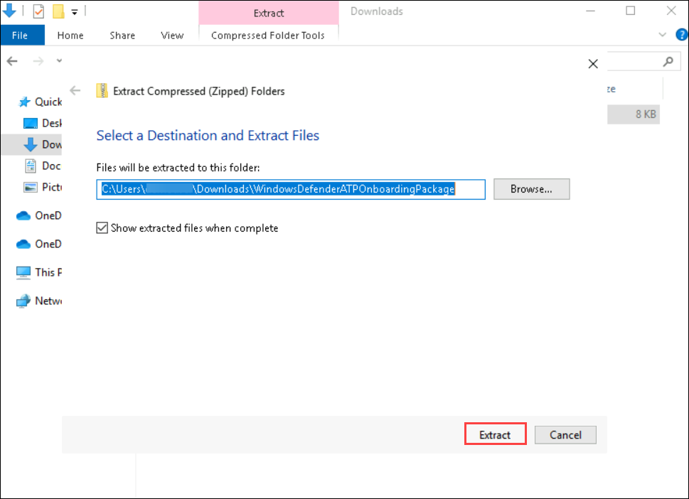 

1. Right-click on the extracted file 'WindowsDefenderATPLocalOnboardingScript.cmd' and choose **Properties**. Tick the **Unblock** checkbox located in the bottom right of the Properties window, and then click **OK**.

    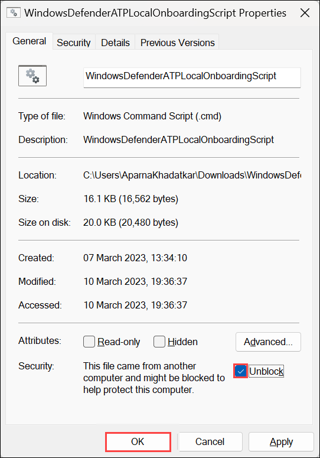 

1. Once again, right-click on the extracted file **WindowsDefenderATPLocalOnboardingScript.cmd** and opt for **Run as Administrator**. **Hint:** If the Windows SmartScreen window appears, click on **More info**, and then select **Run anyway**.
    
1. When the "User Account Control" window appears, select **Yes** to allow the script to run, answer **Y** to the question presented by the script, and press **Enter**. Once complete, you should see a message in the command screen that says *Successfully onboarded machine to Microsoft Defender for Endpoint*.

1. Press any key to continue. This action will close the Command Prompt window.

    

1. Back on the Onboarding page within the Microsoft 365 Defender portal, navigate to the "2. Run a detection test" section, and copy the detection test script by clicking the **Copy** button.

    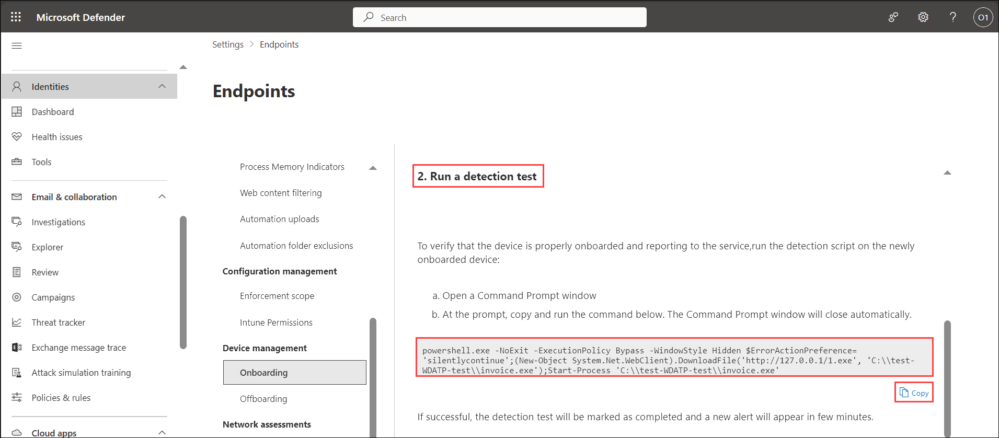 

1. In the Windows search bar of the virtual machine, type **CMD**, and choose **Run as Administrator** from the right pane for the Command Prompt app.

1. When the "User Account Control" window appears, select **Yes** to allow the app to run. 

1. Paste the script by right-clicking in the **Administrator: Command Prompt** window and press **Enter** to run it. **Note:** The window closes automatically after running the script.

1. In the Microsoft 365 Defender portal, navigate to the left-hand menu, and under the **Assets** area, select **Devices**. If the device is not shown, proceed with the next task and return to check it later. It can take up to 60 minutes for the first device to be displayed in the portal.

     

    >**Note:** If you have completed the onboarding process and don't see devices in the Devices list after an hour, it might indicate an onboarding or connectivity problem.

### Task 2: Manage Incidents

In this task, you will manage the incidents in the M365 Defender portal.

1. If you are not already at the Microsoft 365 Defender portal in your Microsoft Edge browser, go to (https://security.microsoft.com). 

1. In the **Sign in** dialog box, copy and paste * Email/Username: <inject key="AzureAdUserEmail"></inject> and then select Next.

1. In the **Enter password** dialog box, copy and paste * Password: <inject key="AzureAdUserPassword"></inject> and then select **Sign in**.

1. From the sidebar menu, under **Incidents and Alerts**, select **Incidents**. Click on the incident **Execution incident on one endpoint**.

1. To manage an incident, click on **Manage Incident** to edit the details of this incident.

   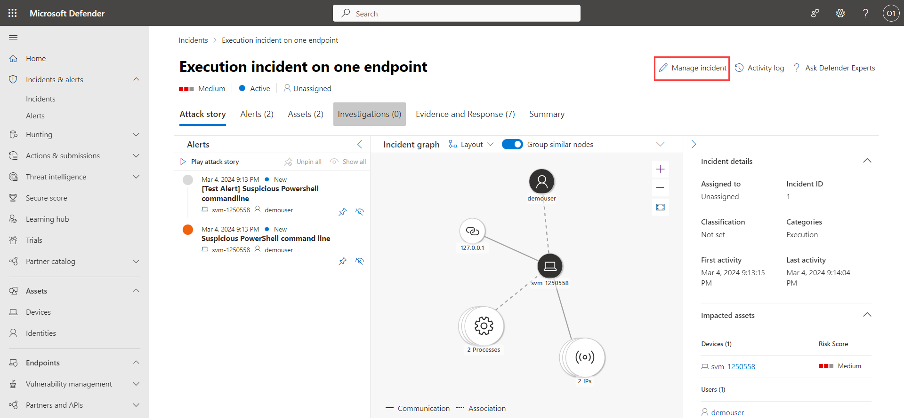 

1. Here, you can edit the name of the incident, add tags, assign it to an existing group or a user, change the status, classify the incident as required, and even add comments.

   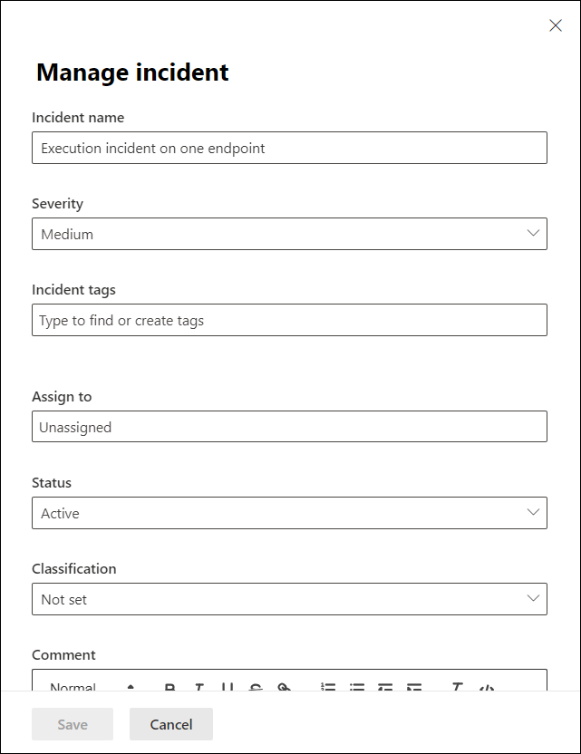

1. In the incident, the **Attack Story** tab provides a summary of the alerts and the incident graph on how these alerts are mapped.

   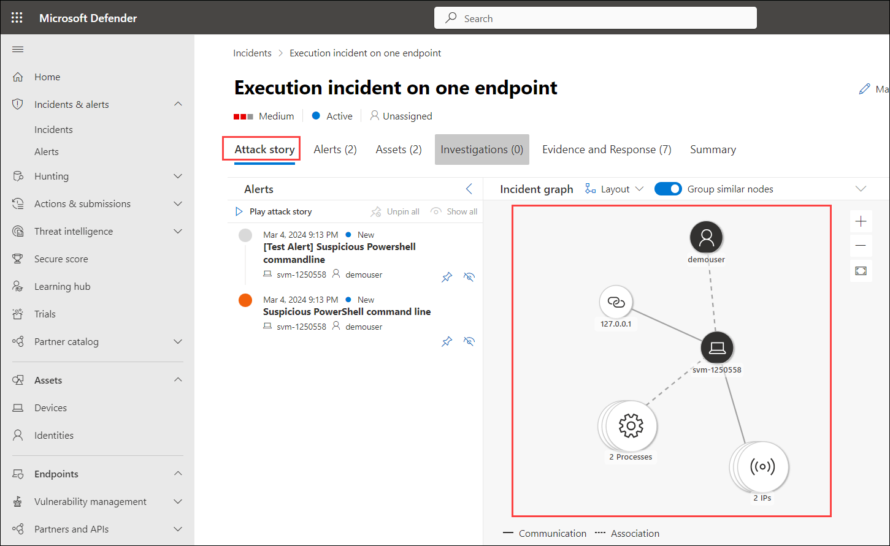

1. You can further investigate these alerts by navigating to the **Alerts** tab.

   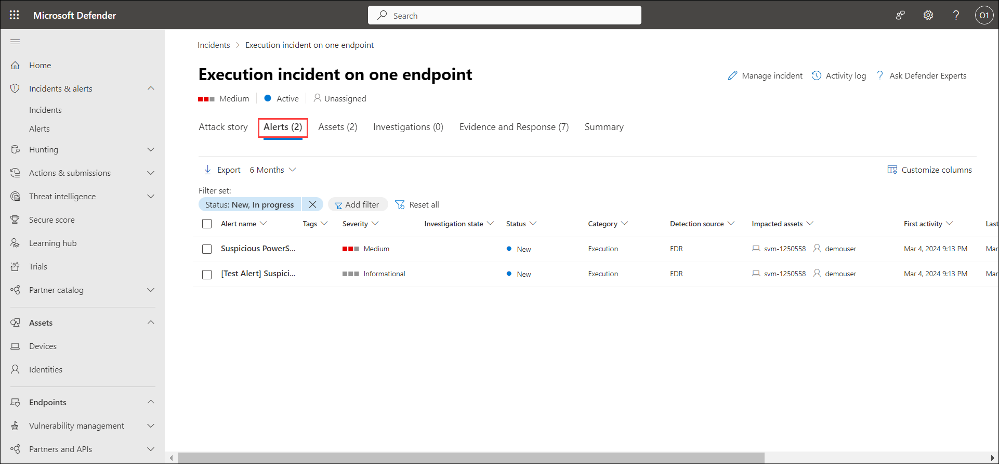

1. You can also see the devices and users affected by this incident in the **Assets** tab. You can verify that the affected device is **svm-<inject key="DeploymentID" enableCopy="false" />** and the user is **demouser**.

   

1. The **Evidence & Responses** tab shows the initial evidence investigated by Microsoft Defender which includes the processes, IP addresses, and registry values.

   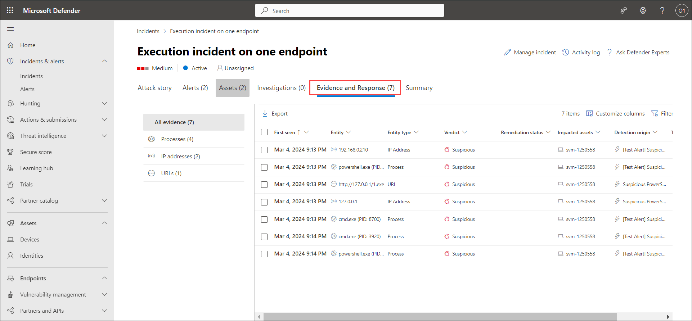

1. The **Summary** tab gives us a summarized report of the incident including active alerts & their category, incident information, scope, and much more.

   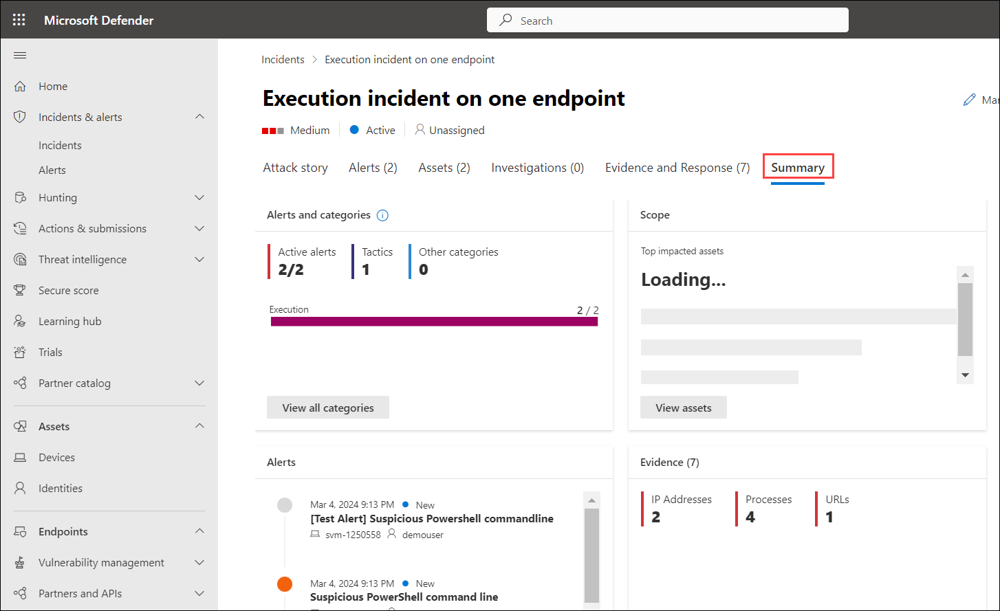

### Task 3: Investigate Alerts

In this task, you will investigate and mitigate the alerts through recommendations by Microsoft Defender.

1. In the Microsoft Defender portal, navigate to the **Alerts** tab from the sidebar menu.

   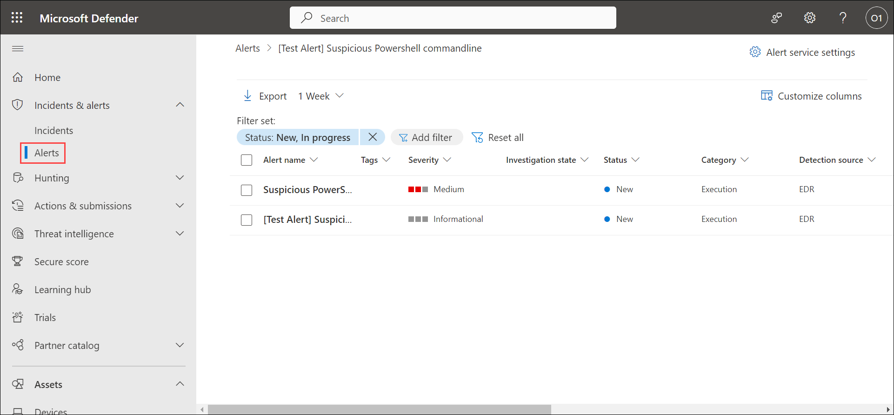

1. You can click on any of these alerts to view the full details. Click on the alert named **Suspicious PowerShell command line**.

1. Click on **Maximize** to view the full alert details.

   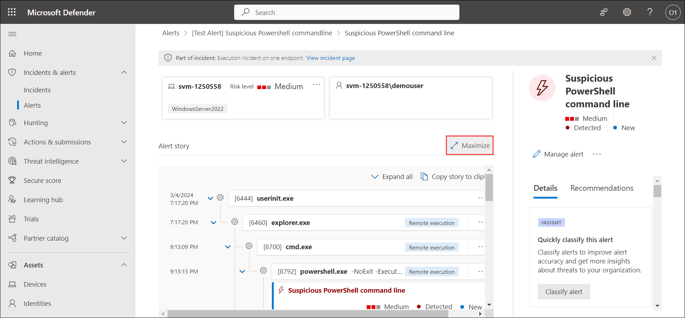

1. Click on the drop-down for the first suspicious behavior to fully investigate the root cause for this activity.

   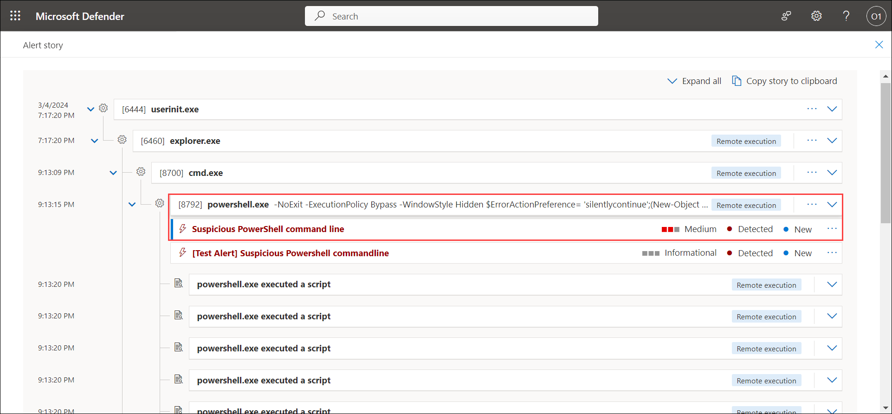

1. You can see that this suspicious behavior was reported when the user ran a certain command. 

   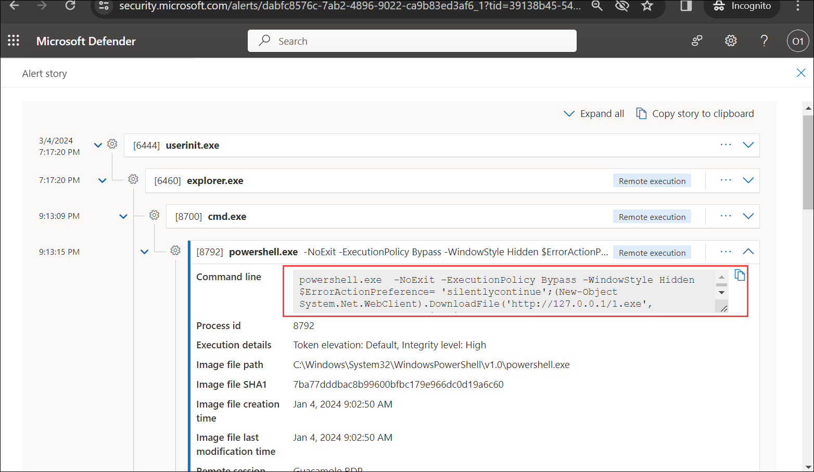

1. Click on the ellipses and then select **Go Hunt**. This will redirect you to a new tab of **Advanced Hunting** where you can run the query and get the results.

   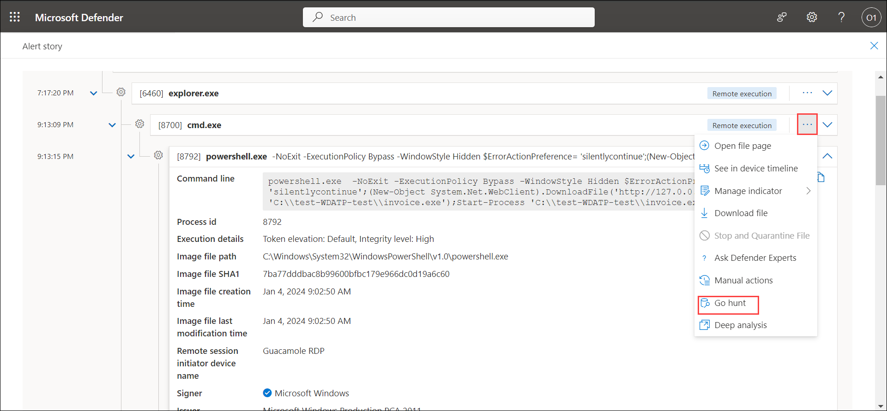

   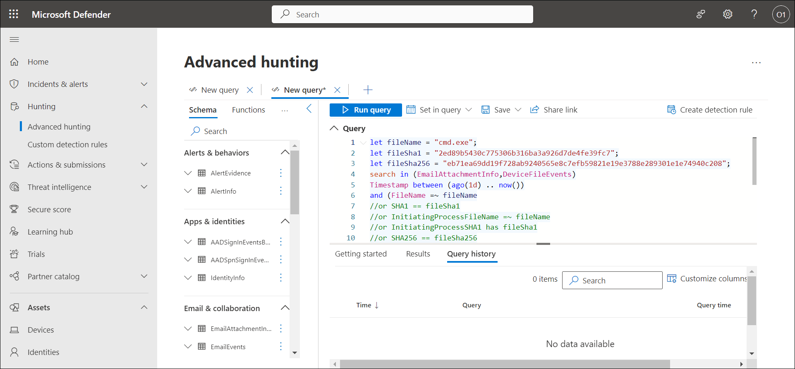

1. You can also investigate the alert further by navigating back to the alerts and clicking on **Deep analysis**.

   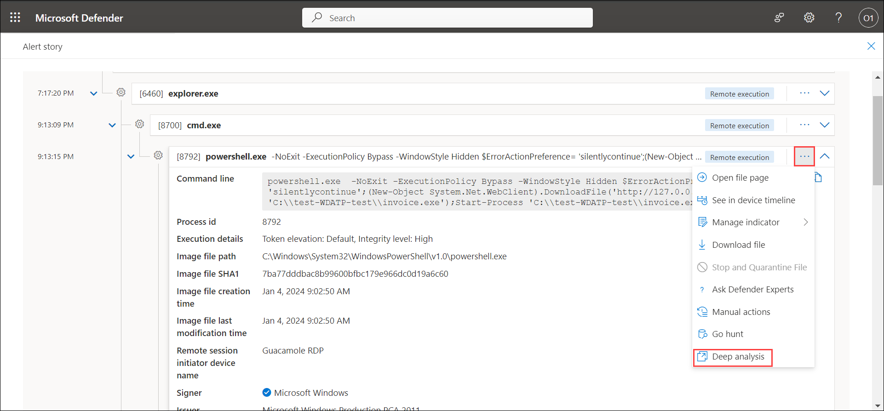

1. You will be redirected to a new tab. Click on **Submit** to get the detailed analyzed file.

   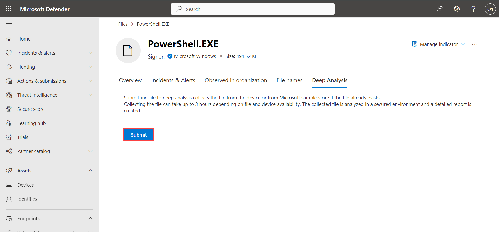

1. This process will take some time, after which you can see the deep analysis of the alert and further investigate it.

   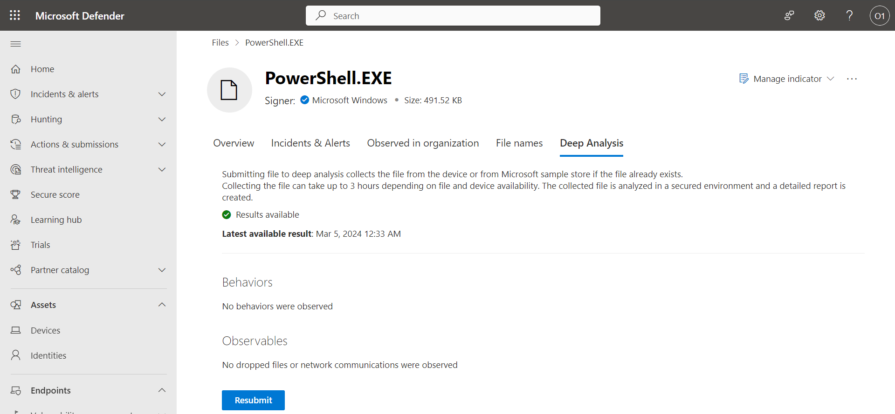

1. Microsoft Defender also provides recommendations to mitigate the alerts. On the alert details page, click on the **Recommendations** tab to view all the recommendations.

   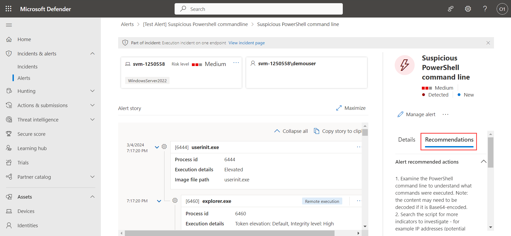

## Review
In this lab, you have completed the following tasks:
- Onboard a Device
- Manage Incidents
- Investigate Alerts
