# Lab 02 - Create queries for Microsoft Sentinel using Kusto Query Language (KQL)

## Lab scenario
You are a Security Operations Analyst working at a company that is implementing Microsoft Sentinel. You are responsible for performing log data analysis to search for malicious activity, display visualizations, and perform threat hunting. To query log data, you use the Kusto Query Language (KQL).

## Lab objectives
 In this lab, you will perform the following:

- Task 1: Connect the Windows security event connector
- Task 2: Enable Microsoft Defender for Cloud
- Task 3: Protect an On-Premises Server
- Task 4: Access the KQL testing area
- Task 5: Run Basic KQL Statements
- Task 6: Analyze Results in KQL with the Summarize Operator
- Task 7: Create visualizations in KQL with the Render Operator
- Task 8: Build multi-table statements in KQL
- Task 9: Work with string data in KQL

## Estimated timing: 60 minutes

## Architecture Diagram

  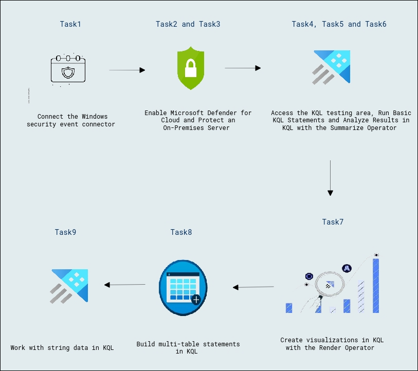

### Task 1: Connect the Windows security event connector

1. In the Search bar of the Azure portal, type *Microsft Sentinel*, then select **Microsoft Sentinel**.

     

1. Select the pre-created Sentinel **loganalyticworkspace** from the available list.

     

1. Navigate to the left menu and go to the Content Management section; there, select **Content Hub (1)**. On the Content Hub page, locate **Windows Security Events (2)**, and then **select (3)** it. Finally, click on **Install (4)**.

    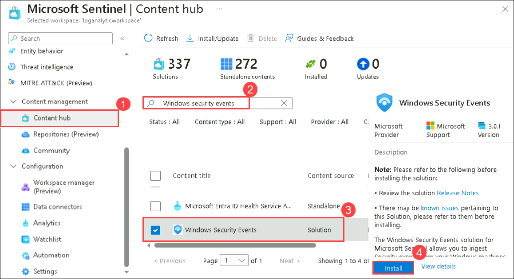  

1. After receiving the notification of a successful installation, return to the Data Connector page and click on the refresh button to ensure that the changes take effect.

1. You should observe two options: **Security Events Via Legacy Agent** and **Windows Security Event Via AMA**.

1. Choose **Security Events Via Legacy Agent**, and then click on **Open Connector Page**.

    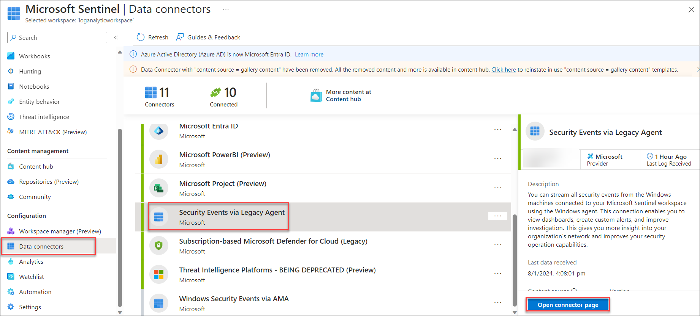 
   
8. In the configuration section, opt for **Install Agent on Azure Windows Virtual Machine (1)**, and then choose **Download & Install Agent for Azure Windows Virtual Machines (2)**.

     

9. Select the **svm-<inject key="DeploymentID" enableCopy="false" />** virtual machine and click on connect.

     
        
10. Once **connected (1)**, select the **Virtual Machine (2)** link from the top.

    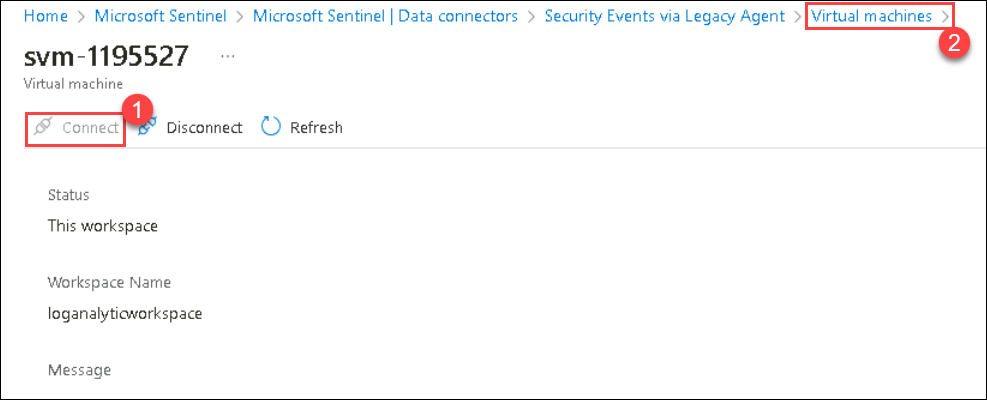 

11. On the virtual machine page select the **s2vm-<inject key="DeploymentID" enableCopy="false" />** virtual machine and click on connect. wait until get connected.

    

11. Then, come back to the Configuration and scroll down a bit. You can find **Select which events to stream**. Click on **All Events**.

     

12. Click on "Apply Changes" now. If you refresh the data connector page, you can see the status "Connected" for **Security Events Via Legacy Agent**.

### Task 2: Enable Microsoft Defender for Cloud

In this task, you will enable and configure Microsoft Defender for Cloud.

1. In the search bar of the Azure portal, type *Defender*, then select **Microsoft Defender for Cloud**.

     

1. Click the left menu, and then click on **Getting Started**.

1. On the **Getting Started** page, under the **Upgrade** tab, ensure your subscription is selected, and then click the **Upgrade** button at the bottom of the page. Please wait for 2-5 minutes for the process to complete, as it may take some time.

     

4. In the left menu for Microsoft Defender for Cloud, under Management, select **Environment settings**.

1. Click on the subscription (or its equivalent name in your language). 

1. Review the Azure resources that are now protected with the Defender for Cloud plans.

1. Select the **Settings & Monitoring** tab from the Settings area (next to Save).
 
     

1. Review the monitoring extensions and confirm that **Log Analytics agent/Azure Monitor agent** is **Off**. Click Continue or close the Settings & Monitoring page by selecting the 'X' on the upper right of the page.

    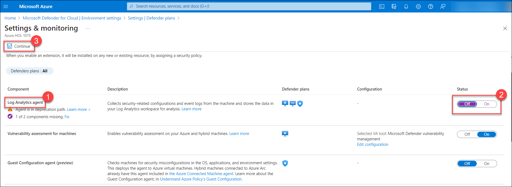 

1. Close the settings page by selecting the 'X' on the upper right of the page to return to the **Environment settings**. Then, click on the '>' to the left of your subscription.

1. Select the Log Analytics workspace named **loganalyticworkspace** to review the available options and pricing.

    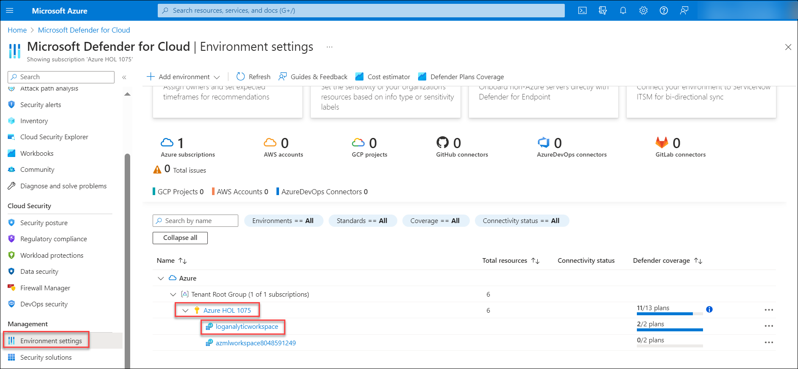 

1. Select **Enable all** (to the right of Select Defender plan), and then choose **Save**. Wait for the *"Microsoft Defender plan for workspace loganalyticworkspace was saved successfully!"* notification to appear.

    >**Note:** If the page is not being displayed, refresh your Edge browser and try again.  

1. Close the Defender plans page by selecting the 'X' in the upper right corner of the page to return to the **Environment settings**.

    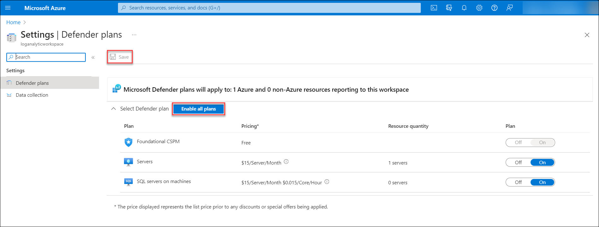 

### Task 3: Protect an On-Premises Server.

In this task, you will manually install the required agent on the Windows Server.

1. Navigate to **Microsoft Defender for Cloud** and choose the **Getting Started** page.

1. Choose the **Get Started** tab.

1. Scroll down and click on **Configure** under the *Add non-Azure servers* section.

      >**Note:** Non-Azure servers use the Log Analytics agent to extend Microsoft Defender for Cloud capabilities to servers running outside of Azure. This includes resources running on-premises and in other clouds.

    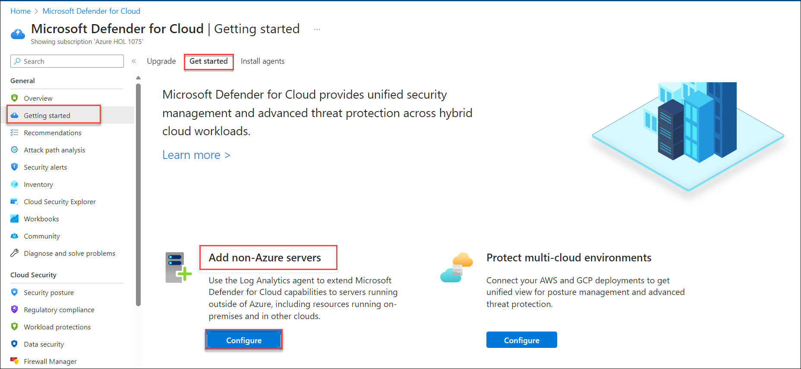 

1. Choose **Upgrade** next to the workspace you created earlier. This process may take a few minutes, so please wait until you see the notification *"Defender plans for the workspace were saved successfully."*

    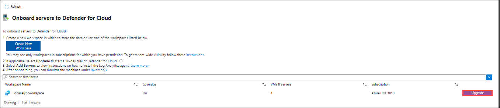

1. Select **+ Add Servers** next to the workspace you created earlier.

    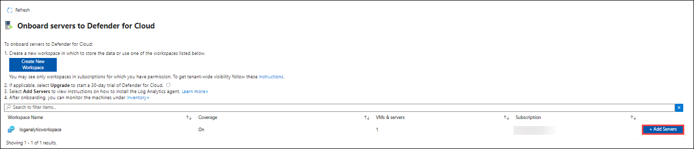

1. Choose **Log Analytics agent instructions**.

1. Choose **Download Windows Agent (64-bit)**.

1. Choose **Open file** to execute the downloaded *MMASetup-AMD64.exe* file.

   >**Note** If it is already installed and prompts for "Repair" or "Remove," select **Repair**. Then, click on Next and proceed to click on **Install**. The installation process may take 2-3 minutes.

1. Continue with the installation process. Once the installation is complete, select **Finish**.

1. Go to the "Microsoft Defender for Cloud" portal and select **Inventory** from the general section.

1. The server should appear in the list. You may need to select **Refresh** to see the update, and it might take a few minutes.

   > **Congratulations** on completing the task! Now, it's time to validate it. Here are the steps:
    > - Click the Lab Validation tab located at the upper right corner of the lab guide section and navigate to the Lab Validation tab.
    > - Hit the Validate button for the corresponding task.
    > - If you receive a success message, you can proceed to the next task. If not, carefully read the error message and retry the step, following the instructions in the lab guide.
    > - If you need any assistance, please contact us at labs-support@spektrasystems.com. We are available 24/7 to help you out.

### Task 4: Access the KQL testing area

In this task, you will access a Log Analytics environment where you can practice writing KQL statements.

1. Go to Microsoft Sentinel and choose your **Log Analytics workspace**.

1. On the left menu, click on **Logs**. Close any tutorial window that pops up by clicking on 'X'.

    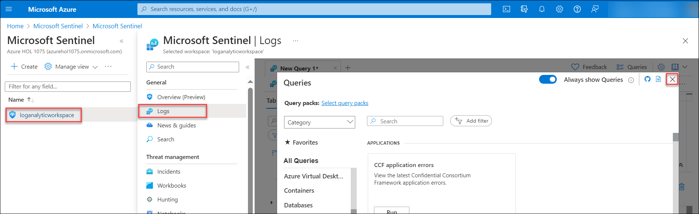 

1. Explore the available tables listed in the tab on the left side of the screen.

1. In the query editor, enter the following query and click on the **Run** button. You should see the query results in the bottom window.

    ```KQL
    SecurityEvent
    ```

1. Next to the first record, select the **>** to expand the information for the row.

     

### Task 5: Run Basic KQL Statements

In this task, you will build basic KQL statements.

>**Important:**  Every time before you start a new query, clear the previous statement from the Query Window or open a new Query Window by selecting **+** after the last opened tab (up to 25).  

1. Change the **Time range** to **Last hour** in the Query Window.

    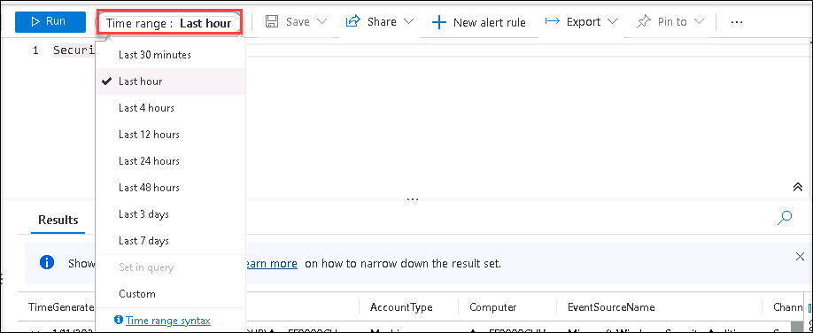 

1. The following statement demonstrates the **search** operator, which searches all columns in the table for the value. In the Query Window, enter the following statement and click on **Run**:

    ```KQL
    search "new"
    ```

    >**Note**: It may take some time to reflect; you can proceed to other commands and check this later. *Hint*: If the above command does not produce output, replace **"new"** with **"err"** and try again.

    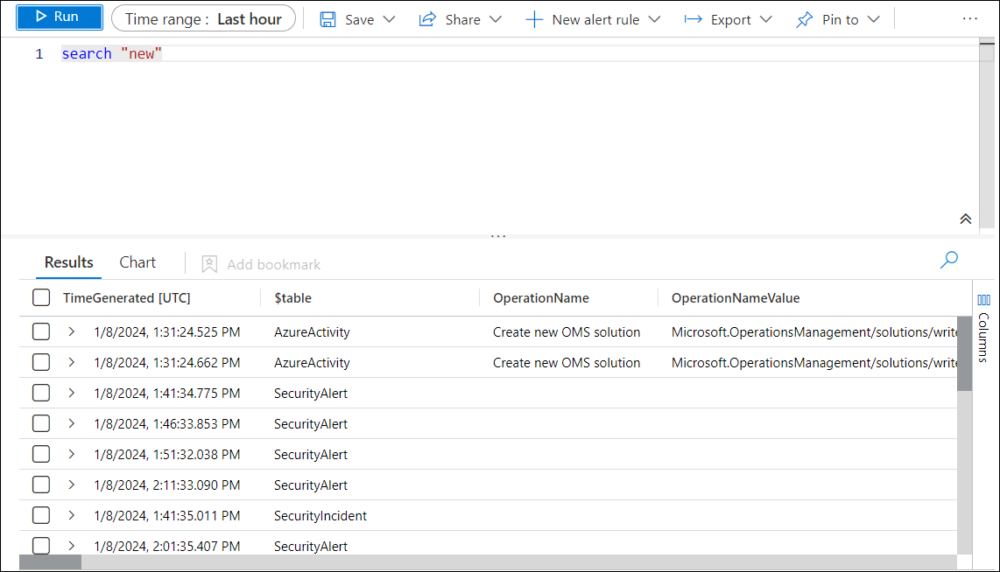

1. The following statement demonstrates **search** across tables listed within the **in** clause. In the Query Window, enter the following statement and click on **Run**:

    ```KQL
    search in (SecurityEvent,SecurityAlert,A*) "new"
    ```

    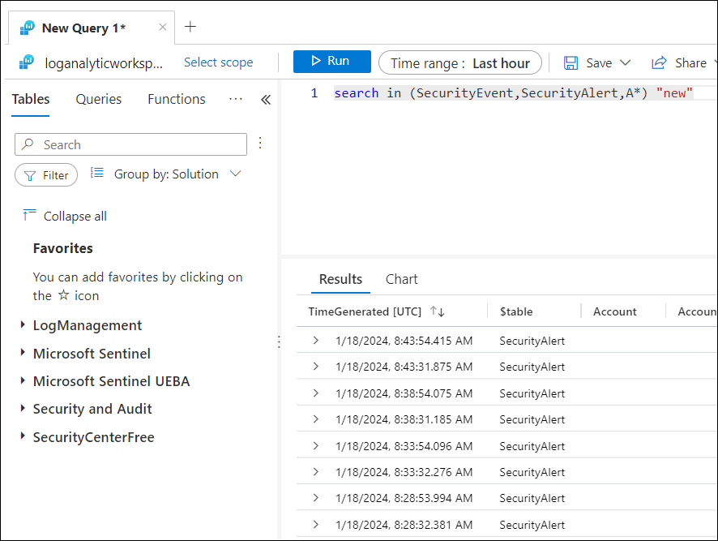

    >**Note**: It may take some time to reflect; you can proceed to other commands and check this later. *Hint*: If the above command does not produce output, replace **"new"** with **"err"** and try again.

1. Change the **Time range** back to **Last 24 hours** in the Query Window.

1. The following statements demonstrate the **where** operator, which filters on a specific predicate. In the Query Window enter the following statements and run each query separately: 

   - Query 1:

        ```KQL
        SecurityEvent  
        | where TimeGenerated > ago(1h)
        ```
    
     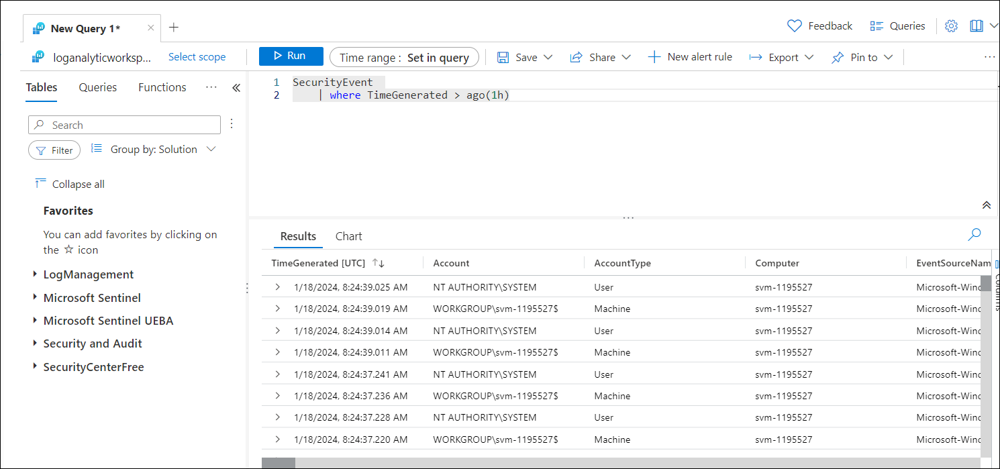

    - Query 2:

        ```KQL
        SecurityEvent  
        | where TimeGenerated > ago(1h) and EventID == "4624"
        ```
        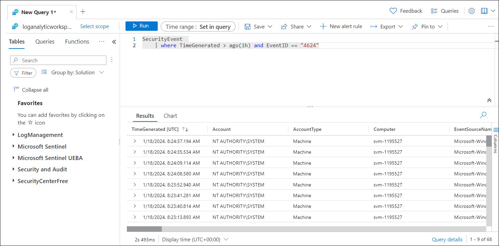

    - Query 3:

        ```KQL
        SecurityEvent  
        | where TimeGenerated > ago(1h)
        | where EventID == 8002
        | where AccountType =~ "user"
        ```
        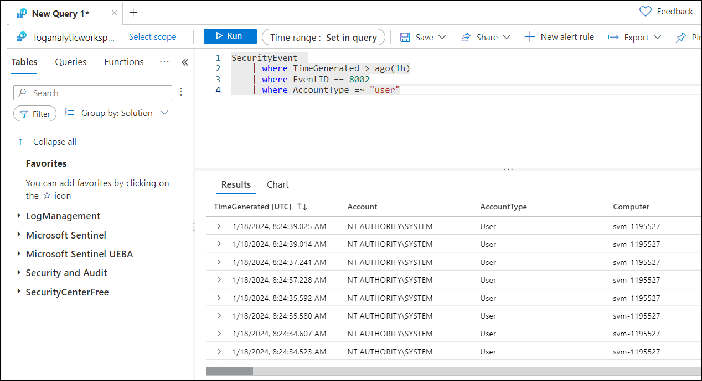

    - Query 4:

        ```KQL
        SecurityEvent  
        | where TimeGenerated > ago(1h) and EventID in (8002, 4688)
        ```
        

1. The following statement demonstrates the use of the **let** statement to declare *variables*. In the Query Window enter the following statement and select **Run**: 

    ```KQL
    let timeOffset = 1h;
    let discardEventId = 4688;
    SecurityEvent
    | where TimeGenerated > ago(timeOffset*2) and TimeGenerated < ago(timeOffset)
    | where EventID != discardEventId
    ```
    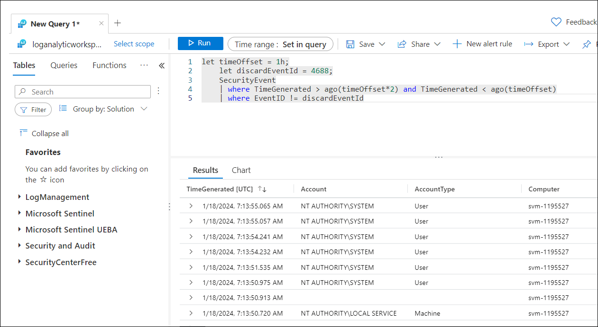

1. The following statement demonstrates the use of the **let** statement to declare a *dynamic list*. In the Query Window enter the following statement and select **Run**: 

    ```KQL
    let suspiciousAccounts = datatable(account: string) [
      @"\administrator", 
      @"NT AUTHORITY\SYSTEM"
    ];
    SecurityEvent  
    | where TimeGenerated > ago(1h)
    | where Account in (suspiciousAccounts)
    ```
    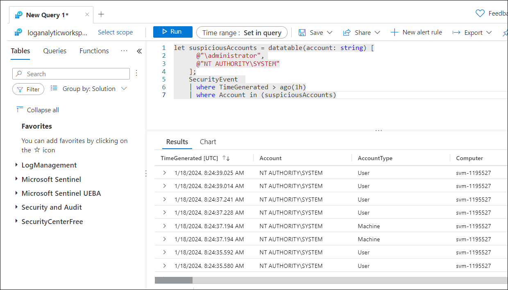

    >**Tip:** You can re-format the query easily by selecting the ellipsis (...) in the Query window and selecting **Format query**.

1. The following statement demonstrates the use of the **let** statement to declare a *dynamic table*. In the Query Window enter the following statement and select **Run**: 

    ```KQL
    let LowActivityAccounts =
        SecurityEvent 
        | summarize cnt = count() by Account 
        | where cnt < 1000;
    LowActivityAccounts
    ```
    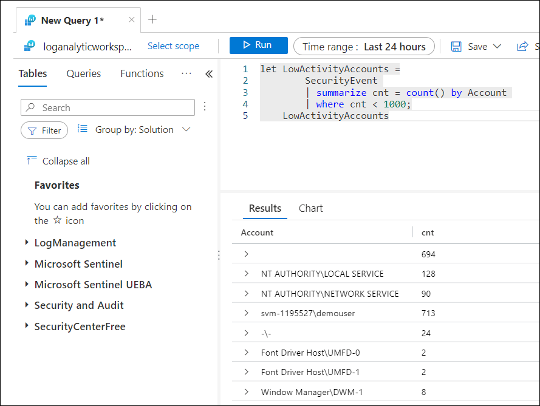

1. Change the **Time range** to **Last hour** in the Query Window. This will limit our results for the following statements.

1. The following statement demonstrates the **extend** operator, which creates a calculated column and adds it to the result set. In the Query Window enter the following statement and select **Run**: 

    ```KQL
    SecurityEvent  
    | where TimeGenerated > ago(1h)
    | where ProcessName != "" and Process != ""
    | extend StartDir =  substring(ProcessName,0, string_size(ProcessName)-string_size(Process))
    ```

    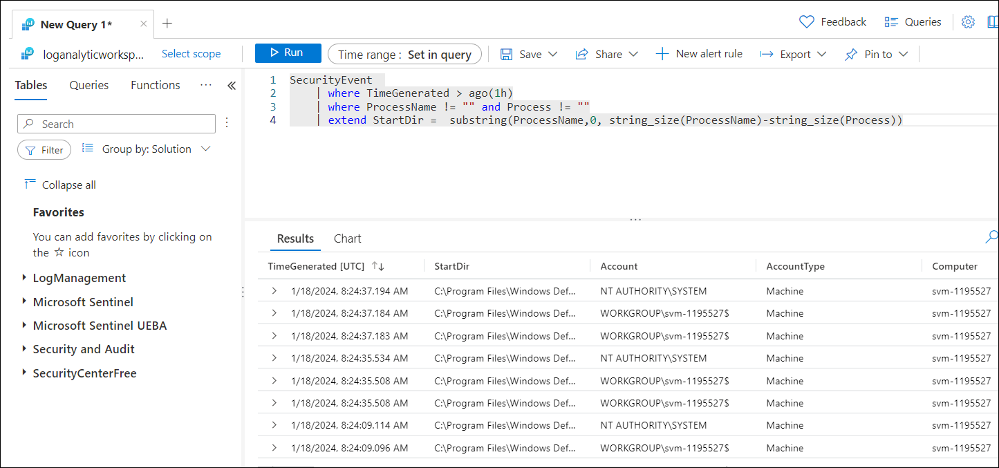

1. The following statement demonstrates the **order by** operator, which sorts the rows of the input table by one or more columns in ascending or descending order. The **order by** operator is an alias to the **sort by** operator. In the Query Window enter the following statement and select **Run**: 

    ```KQL
    SecurityEvent  
    | where TimeGenerated > ago(1h)
    | where ProcessName != "" and Process != ""
    | extend StartDir =  substring(ProcessName,0, string_size(ProcessName)-string_size(Process))
    | order by StartDir desc, Process asc
    ```
   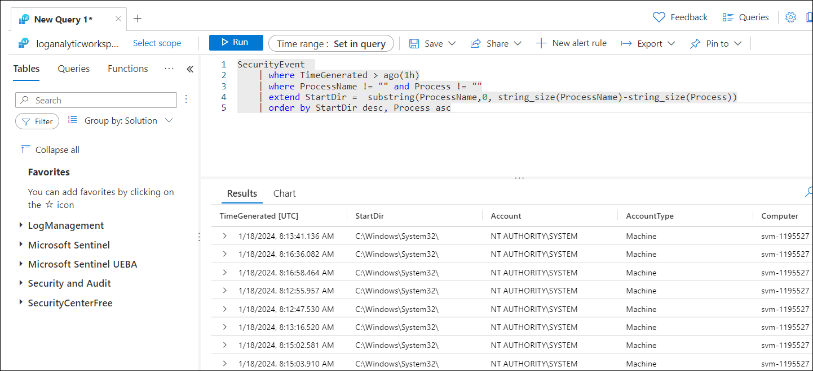

1. The following statements demonstrate the **project** operator, which selects the columns to include in the order specified. In the Query Window enter the following statement and select **Run**: 

    ```KQL
    SecurityEvent  
    | where TimeGenerated > ago(1h)
    | where ProcessName != "" and Process != ""
    | extend StartDir =  substring(ProcessName,0, string_size(ProcessName)-string_size(Process))
    | order by StartDir desc, Process asc
    | project Process, StartDir
    ```
    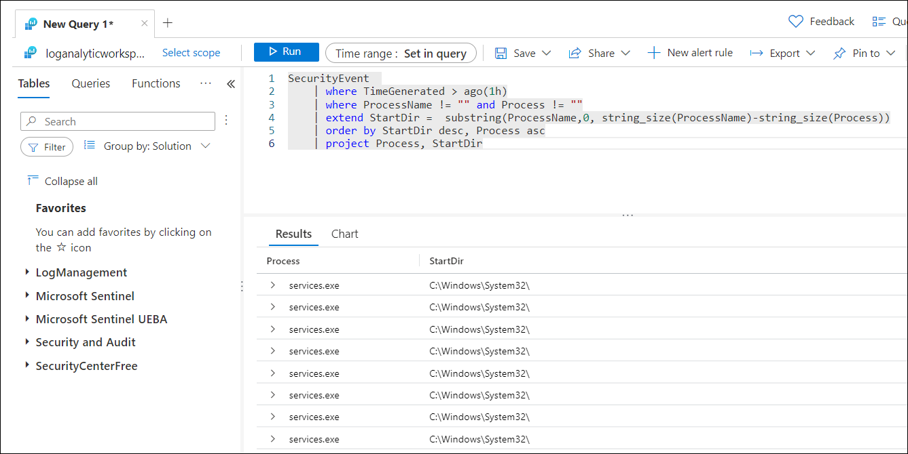

1. The following statements demonstrate the **project-away** operator, which selects the columns to exclude from the output. In the Query Window enter the following statement and select **Run**: 

    ```KQL
    SecurityEvent  
    | where TimeGenerated > ago(1h)
    | where ProcessName != "" and Process != ""
    | extend StartDir =  substring(ProcessName,0, string_size(ProcessName)-string_size(Process))
    | order by StartDir desc, Process asc
    | project-away ProcessName
    ```
    

### Task 6: Analyze Results in KQL with the Summarize Operator

In this task, you will build KQL statements to aggregate data. **Summarize** groups the rows according to the **by** group columns, and calculates aggregations over each group.

1. The following statement demonstrates the **count()** function, which returns a count of the group. In the Query Window enter the following statement and select **Run**: 

    ```KQL
    SecurityEvent  
    | where TimeGenerated > ago(1h) and EventID == '4688'  
    | summarize count() by Process, Computer
    ```
    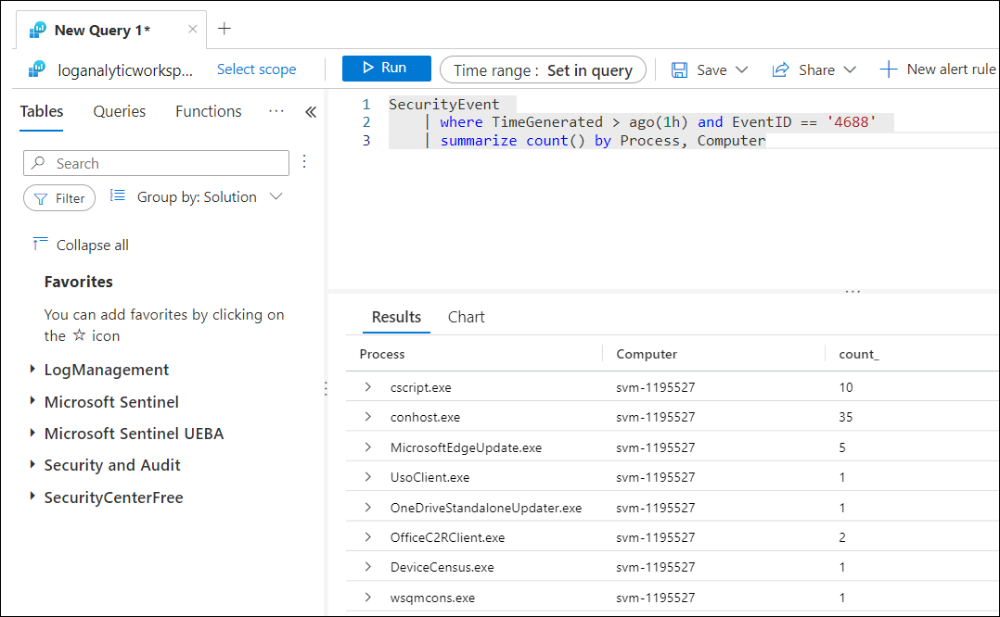

1. The following statement demonstrates the **count()** function, but in this example, we name the column as *cnt*. In the Query Window enter the following statement and select **Run**: 

    ```KQL
    SecurityEvent  
    | where TimeGenerated > ago(1h) and EventID == '4624'  
    | summarize cnt=count() by AccountType, Computer
    ```
    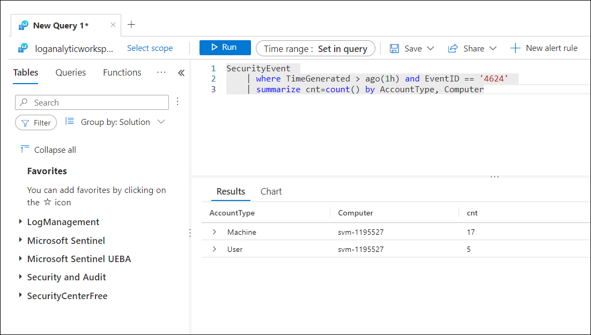

1. The following statement demonstrates the **dcount()** function, which returns an approximate distinct count of the group elements. In the Query Window enter the following statement and select **Run**: 

    ```KQL
    SecurityEvent  
    | where TimeGenerated > ago(1h)
    | summarize dcount(IpAddress)
    ```
    

1. The following statements demonstrate the importance of understanding results based on the order of the *pipe*. In the Query Window enter the following queries and run each query separately: 

    1. **Query 1** will have Accounts for which the last activity was a login. The SecurityEvent table will first be summarized and return the most current row for each Account. Then only rows with EventID equals 4624 (login) will be returned.

        ```KQL
        SecurityEvent  
        | summarize arg_max(TimeGenerated, *) by Account
        | where EventID == '4624'  
        ```
        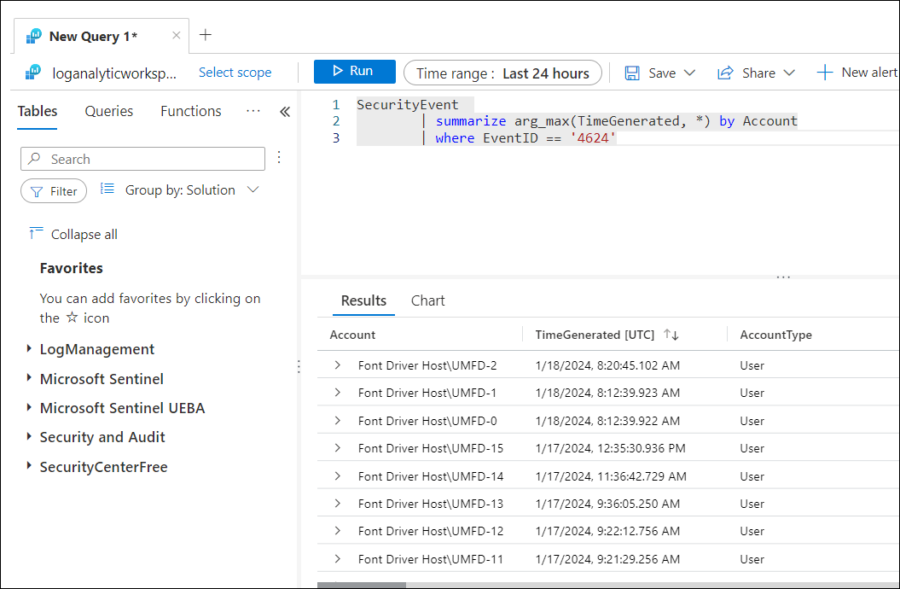

    1. **Query 2** will have the most recent login for Accounts that have logged in. The SecurityEvent table will be filtered to only include EventID = 4624. Then these results will be summarized for the most current login row by Account.

        ```KQL
        SecurityEvent  
        | where EventID == '4624'  
        | summarize arg_max(TimeGenerated, *) by Account
        ```
        

    >**Note:**  You can also review the "Total CPU" and "Data used for processed query" by selecting the "Query details" link on the lower right and compare the data between both statements.

1. The following statement demonstrates the **make_list()** function, which returns a *list* of all the values within the group. This KQL query will first filter the EventID with the where operator. Next, for each Computer, the results are a JSON array of Accounts. The resulting JSON array will include duplicate accounts. In the Query Window enter the following statement and select **Run**: 

    ```KQL
    SecurityEvent  
    | where TimeGenerated > ago(1h)
    | where EventID == '4624'  
    | summarize make_list(Account) by Computer
    ```
    

1. The following statement demonstrates the **make_set()** function, which returns a set of *distinct* values within the group. This KQL query will first filter the EventID with the where operator. Next, for each Computer, the results are a JSON array of unique Accounts. In the Query Window enter the following statement and select **Run**: 

    ```KQL
    SecurityEvent  
    | where TimeGenerated > ago(1h)
    | where EventID == '4624'  
    | summarize make_set(Account) by Computer
    ```
    

### Task 7: Create visualizations in KQL with the Render Operator

In this task, you will generate visualizations with KQL statements.

1. The following statement demonstrates the **render** operator (which renders results as a graphical output), using a **barchart** visualization. In the Query Window enter the following statement and select **Run**: 

    ```KQL
    SecurityEvent  
    | where TimeGenerated > ago(1h)
    | summarize count() by Account
    | render barchart
    ```
     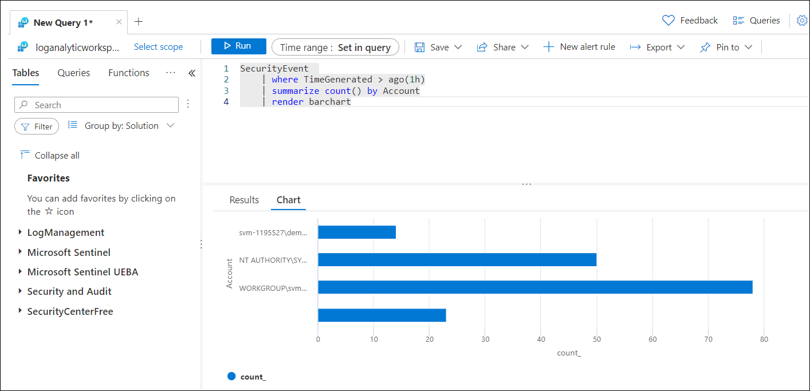

1. The following statement demonstrates the **render** operator visualizing results with a time series. The **bin()** function rounds all values in a timeframe and groups them, used frequently in combination with **summarize**. If you have a scattered set of values, the values are grouped into a smaller set of specific values. Combining the generated results and pipe them to a **render** operator with a **time chart** provides a time series visualization. In the Query Window enter the following statement and select **Run**: 

    ```KQL
    SecurityEvent  
    | where TimeGenerated > ago(1h)
    | summarize count() by bin(TimeGenerated, 1m)
    | render timechart
    ```
     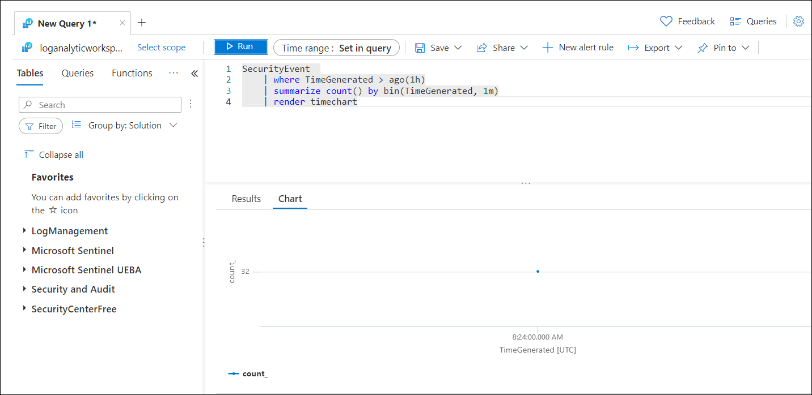

### Task 8: Build multi-table statements in KQL

In this task, you will build multi-table KQL statements.

1. Change the **Time range** to **Last hour** in the Query Window. This will limit our results for the following statements.

1. The following statement demonstrates the **union** operator, which takes two or more tables and returns all their rows. Understanding how results are passed and impacted with the pipe character is essential. In the Query Window enter the following statements and select **Run** for each query separately to see the results: 

    1. **Query 1** will return all rows of SecurityEvent and all rows of SigninLogs.

        ```KQL
        SecurityEvent  
        | union SigninLogs  
        ```
       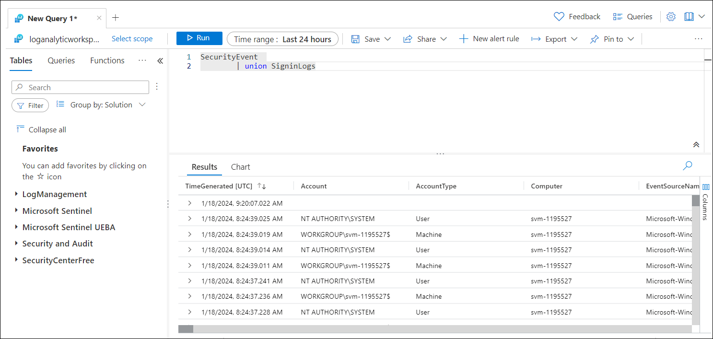

    1. **Query 2** will return one row and column, which is the count of all rows of SigninLogs and all rows of SecurityEvent.

        ```KQL
        SecurityEvent  
        | union SigninLogs  
        | summarize count() 
        ```
       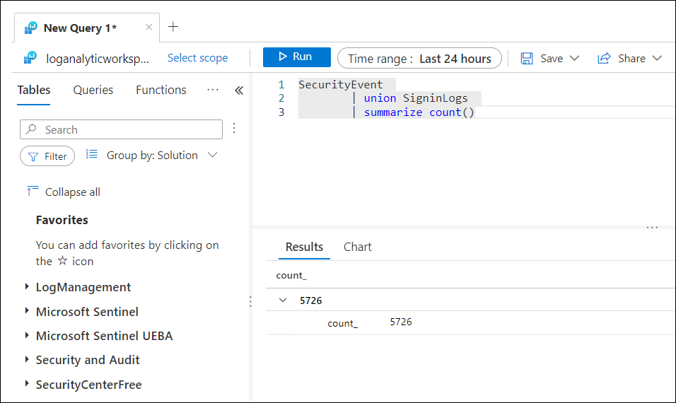

    1. **Query 3** will return all rows of SecurityEvent and one (last) row for SigninLogs. The last row for SigninLogs will have the summarized count of the total number of rows.

        ```KQL
        SecurityEvent  
        | union (SigninLogs | summarize count() | project count_)
        ```
       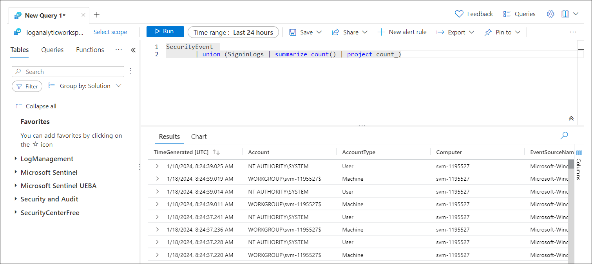

1. The following statement demonstrates the **union** operator's support to union multiple tables with wildcards. In the Query Window enter the following statement and select **Run**: 

    ```KQL
    union Security*  
    | summarize count() by Type
    ```
    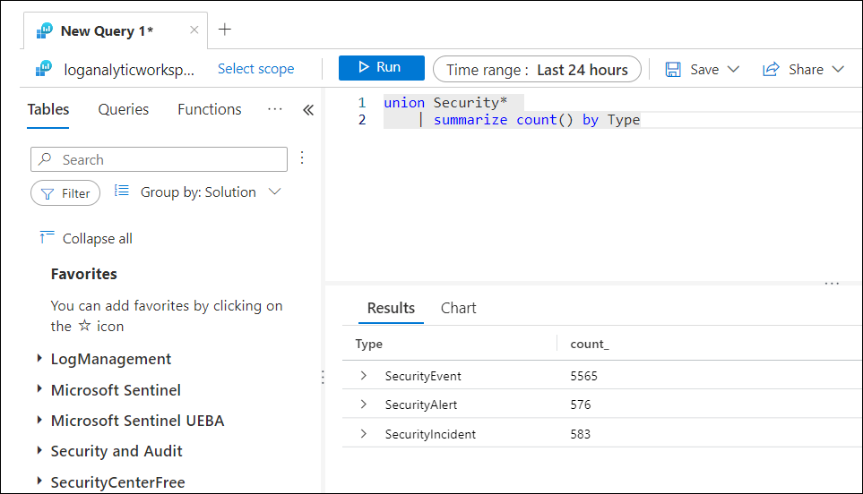

1. The following statement demonstrates the **join** operator, which merges the rows of two tables to form a new table by matching the values of the specified column(s) from each table. In the Query Window enter the following statement and select **Run**: 

    ```KQL
    SecurityEvent  
    | where EventID == "4624" 
    | summarize LogOnCount=count() by EventID, Account
    | project LogOnCount, Account
    | join kind = inner( 
     SecurityEvent  
    | where EventID == "4634" 
    | summarize LogOffCount=count() by EventID, Account
    | project LogOffCount, Account
    ) on Account
    ```
    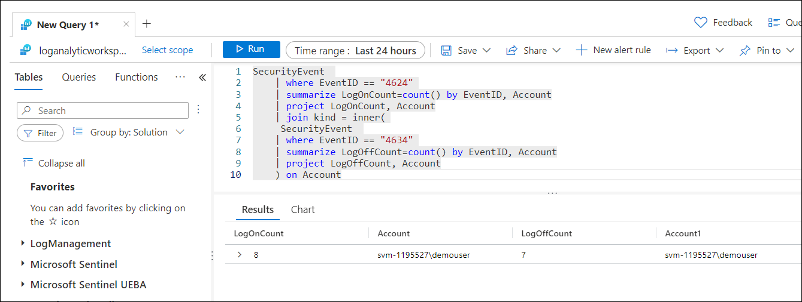

    >**Important:** The first table specified in the join is considered the Left table. The table after the **join** operator is the right table. When working with columns from the tables, the $left.Column name and $right.Column name is to distinguish which tables column are referenced. The **join** operator supports a full range of types: flouter, inner, innerunique, leftanti, leftantisemi, leftouter, leftsemi, rightanti, rightantisemi, rightouter, rightsemi.


### Task 9: Work with string data in KQL

In this task, you will work with structured and unstructured string fields with KQL statements.

1. The following statement demonstrates the **extract** function, which gets a match for a regular expression from a source string. You have the option to convert the extracted substring to the indicated type. In the Query Window, enter the following statement and select **Run**: 

    ```KQL
    print extract("x=([0-9.]+)", 1, "hello x=45.6|wo") == "45.6"
    ```

    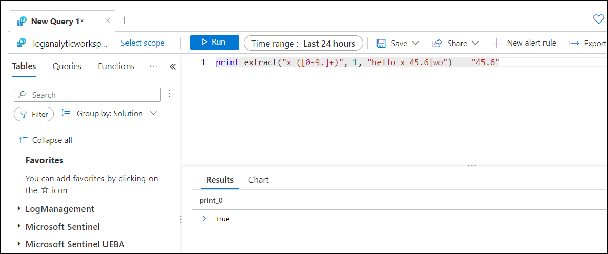

1. The following statements use the **extract** function to pull out the Account Name from the Account field of the SecurityEvent table. In the Query Window enter the following statement and select **Run**: 

    ```KQL
    SecurityEvent  
    | where EventID == '4688' and AccountType == 'User' 
    | extend Account_Name = extract(@"^(.*\\)?([^@]*)(@.*)?$", 2, tolower(Account))
    | summarize LoginCount = count() by Account_Name
    | where Account_Name != ""
    | where LoginCount < 10
    ```

1. The following statement demonstrates the **parse** operator, which evaluates a string expression and parses its value into one or more calculated columns. Use for structuring unstructured data. In the Query Window enter the following statement and select **Run**: 

    ```KQL
    let Traces = datatable(EventText:string)
    [
    "Event: NotifySliceRelease (resourceName=PipelineScheduler, totalSlices=27, sliceNumber=23, lockTime=02/17/2016 08:40:01, releaseTime=02/17/2016 08:40:01, previousLockTime=02/17/2016 08:39:01)",
    "Event: NotifySliceRelease (resourceName=PipelineScheduler, totalSlices=27, sliceNumber=15, lockTime=02/17/2016 08:40:00, releaseTime=02/17/2016 08:40:00, previousLockTime=02/17/2016 08:39:00)",
    "Event: NotifySliceRelease (resourceName=PipelineScheduler, totalSlices=27, sliceNumber=20, lockTime=02/17/2016 08:40:01, releaseTime=02/17/2016 08:40:01, previousLockTime=02/17/2016 08:39:01)",
    "Event: NotifySliceRelease (resourceName=PipelineScheduler, totalSlices=27, sliceNumber=22, lockTime=02/17/2016 08:41:01, releaseTime=02/17/2016 08:41:00, previousLockTime=02/17/2016 08:40:01)",
    "Event: NotifySliceRelease (resourceName=PipelineScheduler, totalSlices=27, sliceNumber=16, lockTime=02/17/2016 08:41:00, releaseTime=02/17/2016 08:41:00, previousLockTime=02/17/2016 08:40:00)"
    ];
    Traces  
    | parse EventText with * "resourceName=" resourceName ", totalSlices=" totalSlices:long * "sliceNumber=" sliceNumber:long * "lockTime=" lockTime ", releaseTime=" releaseTime:date "," * "previousLockTime=" previousLockTime:date ")" *  
    | project resourceName, totalSlices, sliceNumber, lockTime, releaseTime, previousLockTime
    ```
    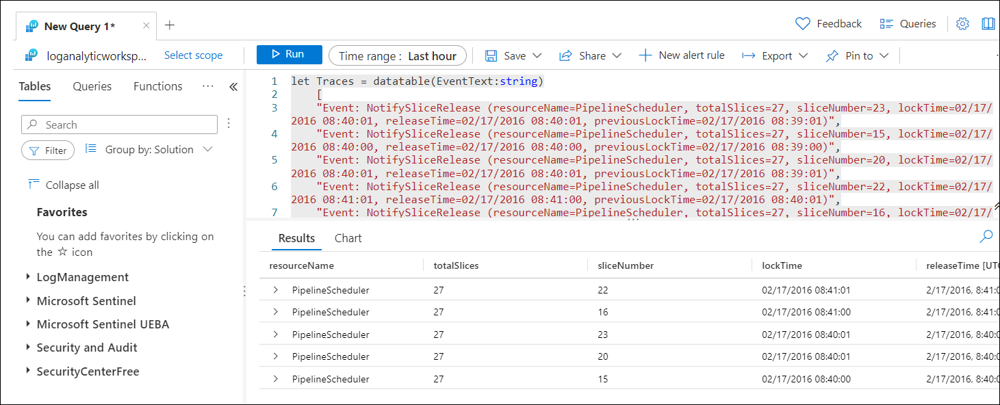

1. The following statement demonstrates working with **dynamic** fields, which are special since they can take on any value of other data types. In this example, The DeviceDetail field from the SigninLogs table is of type **dynamic**. In the Query Window enter the following statement and select **Run**: 

    ```KQL
    SigninLogs | extend OS = DeviceDetail.operatingSystem
    ```
    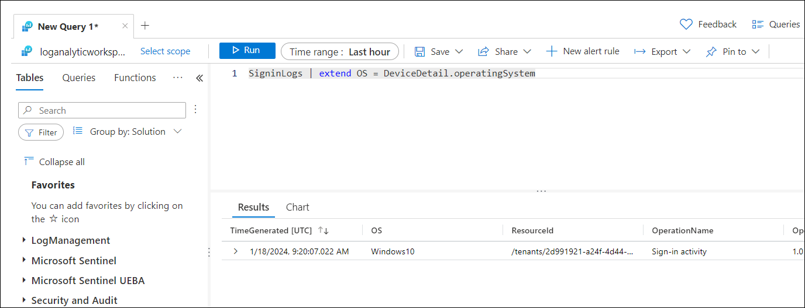

1. The following example shows how to break out packed fields for SigninLogs. In the Query Window enter the following statement and select **Run**: 

    ```KQL
    SigninLogs | extend OS = DeviceDetail.operatingSystem, Browser = DeviceDetail.browser
    | extend CAPol0Name = tostring(ConditionalAccessPolicies[0].displayName), CAPol0Result = tostring(ConditionalAccessPolicies[0].result)
    | extend CAPol1Name = tostring(ConditionalAccessPolicies[1].displayName), CAPol1Result = tostring(ConditionalAccessPolicies[1].result)
    | extend CAPol2Name = tostring(ConditionalAccessPolicies[2].displayName), CAPol2Result = tostring(ConditionalAccessPolicies[2].result)
    | extend StatusCode = tostring(Status.errorCode), StatusDetails = tostring(Status.additionalDetails)
    | extend Date = startofday(TimeGenerated), City = tostring(LocationDetails.city)
    | summarize count() by Date, Identity, UserDisplayName, UserPrincipalName, IPAddress, City, ResultType, ResultDescription, StatusCode, StatusDetails, CAPol0Name, CAPol0Result, CAPol1Name, CAPol1Result, CAPol2Name, CAPol2Result
    | sort by Date
    ```
     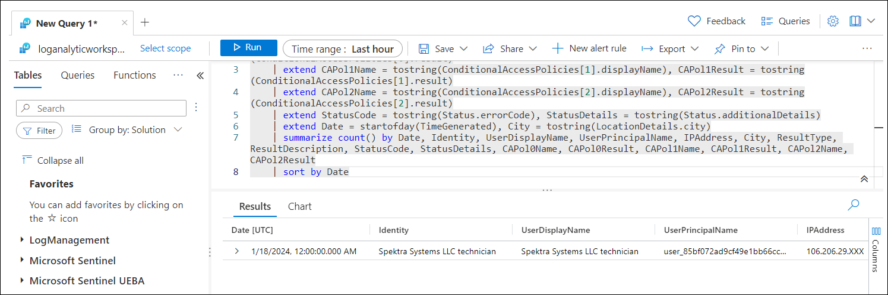

    >**Important:** Although the dynamic type appears JSON-like, it can hold values that the JSON model does not represent because they do not exist in JSON. Therefore, in serializing dynamic values into a JSON representation, values that JSON cannot represent are serialized into string values. 

1. **[Read-Only]** The following statements demonstrate operators to manipulate JSON stored in string fields. Many logs submit data in JSON format, which requires you to know how to transform JSON data into fields that can be queried. In the Query Window enter the following statement and select **Run**: 

    ```KQL
    SigninLogs | extend Location =  todynamic(LocationDetails)
    | extend City =  Location.city
    | extend City2 = Location["city"]
    | project Location, City, City2
    ```

1.  The following statement demonstrates the **mv-expand** operator, which turns dynamic arrays into rows (multi-value expansion).

    ```KQL
    SigninLogs | mv-expand Location = todynamic(LocationDetails)
    ```
    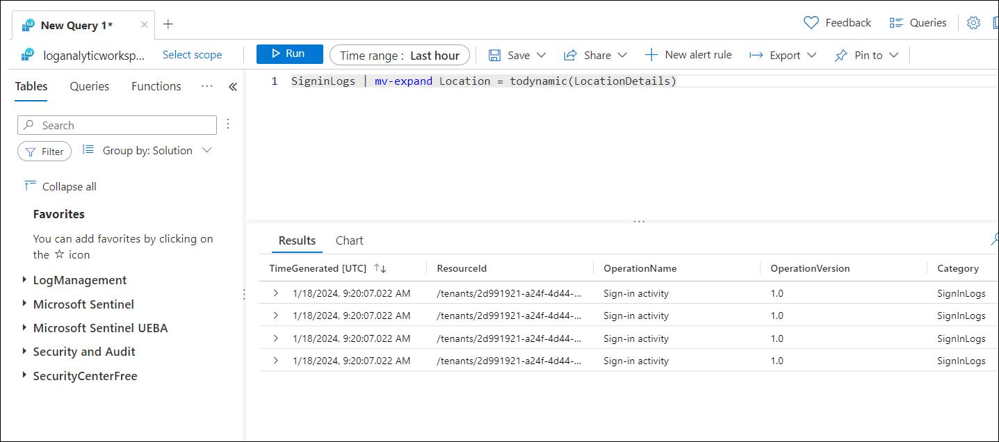

1. **[Read-Only]** The following statement demonstrates the **mv-apply** operator, which applies a subquery to each record and returns the union of the results of all subqueries.

    ```KQL
    SigninLogs  
    | mv-apply Location = todynamic(LocationDetails) on 
    ( where Location.countryOrRegion == "ES")
    ```

1. A **function** is a log query that can be used in other log queries with the saved name as a command. To create a **function**, after running your query, select the **Save** button and then select **Save As function** from the drop-down. Enter the name you want (for example: *PrivLogins*) in the **Function name** box and enter a **Legacy category** (for example: *General*) and select **Save**. The function will be available in KQL by using the function's alias:

    >**Note:** You will not be able to do this in the lab demo environment used for this lab since your account has only Reader permissions, but it is an important concept to make your queries more efficient and effective. 

    ```KQL
    PrivLogins  
    ```
    
## Review
In this lab, you have completed the following:
- Connect the Windows security event connector
- Enable Microsoft Defender for Cloud
- Protect an On-Premises Server
- Access the KQL testing area
- Run Basic KQL Statements
- Analyze Results in KQL with the Summarize Operator
- Create visualizations in KQL with the Render Operator
- Build multi-table statements in KQL
- Work with string data in KQL
