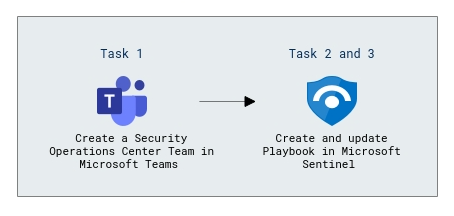
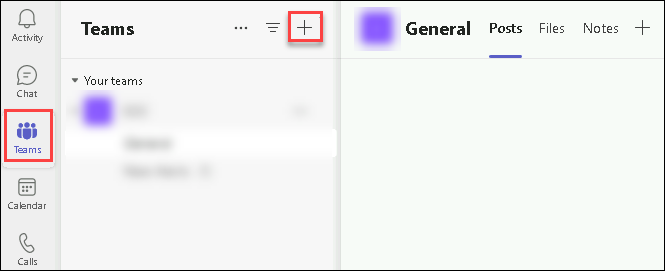
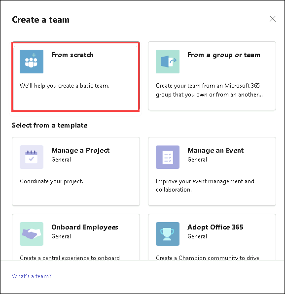
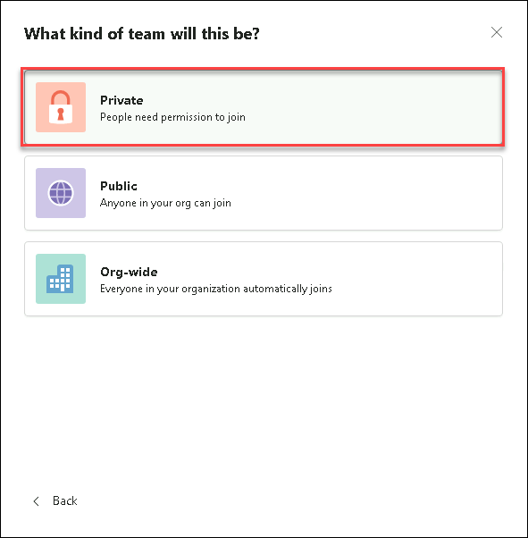
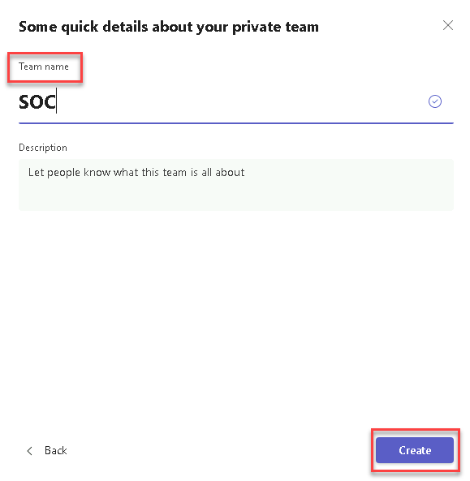
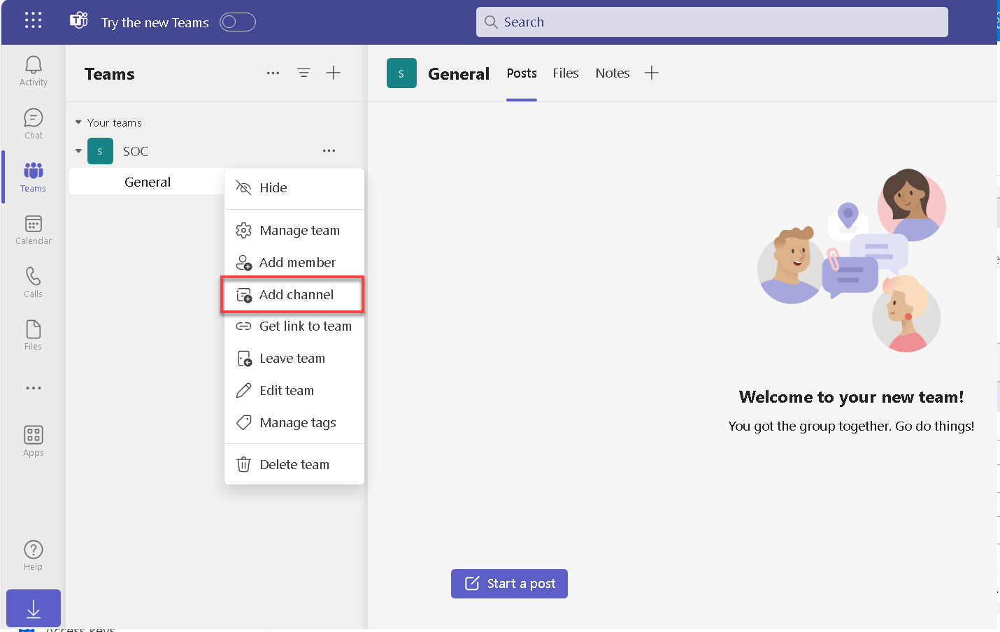
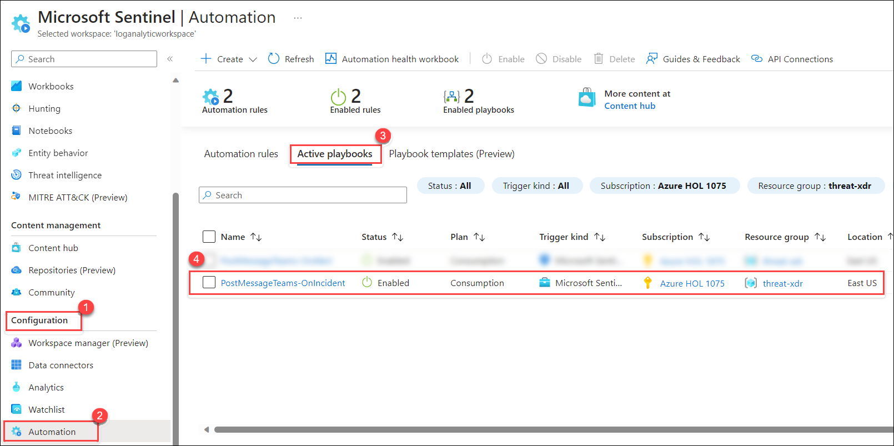

# Lab 03 - Integrate Logic App with Threat Protection and XDR

## Lab scenario

The integration of a Logic App with Threat Protection involves configuring triggers and actions to receive alerts, while interaction with XDR solutions requires adding actions to exchange data, perform analyses, and trigger responses. Implementing conditional checks and logic within the Logic App allows for tailored handling of received threat information, ensuring effective responses and workflow execution before thorough testing and deployment to production environments. 

## Lab objectives
 In this lab, you will perform the following:
 - Task 1: Create a Security Operations Center Team in Microsoft Teams
 - Task 2: Create a Playbook in Microsoft Sentinel
 - Task 3: Update a Playbook in Microsoft Sentinel
 
## Estimated timing: 60 minutes

## Architecture Diagram
 

### Task 1: Create a Security Operations Center Team in Microsoft Teams.

In this task, you will create a team in Microsoft Teams for use in the lab.  

1. Select the the Microsoft Teams from the desktop and click to open.

1. select **Teams** on the left menu, then select **Join or create a team**.

     

3. Select the **Create Team** button in the main window.

1. Select the **From scratch** button.

      
       
1. Select the **Private** button.

     

1. Give the team the name: **SOC** and select the **Create** button.

      

1. In the Add members to SOC screen, select the **Skip** button. 

1. Scroll down the Teams blade to locate the newly created SOC team, select the ellipsis **(...)** on the right side of the name and select **Add channel**.
     

1. Enter a channel name as *New Alerts* then select the **Add** button.

### Task 2: Create a Playbook in Microsoft Sentinel.

In this task, you'll create a Logic App that is used as a Playbook in Microsoft Sentinel.

1. In the Microsoft Edge browser, navigate to [Microsoft Sentinel](https://github.com/Azure/Azure-Sentinel) on GitHub.

1. Scroll down and select the **Solutions** folder.

1. Next select the **SentinelSOARessentials** folder, then the **Playbooks** folder.

1. Select the **Post-Message-Teams** folder.

1. In the readme.md box, scroll down to the *Quick Deployment* section, **Deploy with incident trigger (recommended)** and select the **Deploy to Azure** button.

     

1. Make sure your Azure Subscription is selected.

1. For Resource Group, select **Create New**, enter *threat-xdr* and select **OK**.

1. Leave **(US) East US** as the default value for *Region*.

1. Rename the *Playbook Name* to **PostMessageTeams-OnIncident** and select **Review + create**.

1. Now select **Create**.

    **Note:** Wait for the deployment to finish before proceeding to the next task. It may take a couple minutes to deploy.

### Task 3: Update a Playbook in Microsoft Sentinel.

In this task, you will update the new playbook you created with the proper connection information.

1. In the Search bar of the Azure portal, type *Sentinel*, then select **Microsoft Sentinel**.

1. Select your Microsoft Sentinel Workspace.

1. Select the **Automation** from the Configuration area and then select the **Active Playbooks** tab.

1. Select the **PostMessageTeams-OnIncident** playbook.

     

1. On the Logic App page for *PostMessageTeams-OnIncident*, in the center menu, select **Edit**.

1. Select the *first* block **Microsoft Sentinel Incident(Preview)**.

1. Select the **Change connection** link.

1. Select **Add new** and select **Sign in**. In the new window, select your Azure subscription admin credentials when prompted.The last line of the block should now read “Connected to your-admin-username”.

1. Now select the *second block*, **Connections**.

1. Select **Add new** and select your Azure admin credentials when prompted. The last line of the block should now read “Connected to your-admin-username”.

1. The block has now been renamed to **Post a message (V3)**, at the end of the Team field, select the X to clear the contents. The field is changed to a drop-down with a listing of the available Teams from Microsoft Teams. Select **SOC**.

1. Do the same for the Channel field, select the **X** at the end of the field to clear the contents. The field is changed to a drop-down with a listing of the Channels of the SOC Teams. Select **New Alerts**.

    

1. Select **Save** on the command bar. The Logic App will be used in a future lab.

## Review
 In this lab, you will perform the following:
 - Create a Security Operations Center Team in Microsoft Teams
 - Create a Playbook in Microsoft Sentinel
 - Update a Playbook in Microsoft Sentinel
