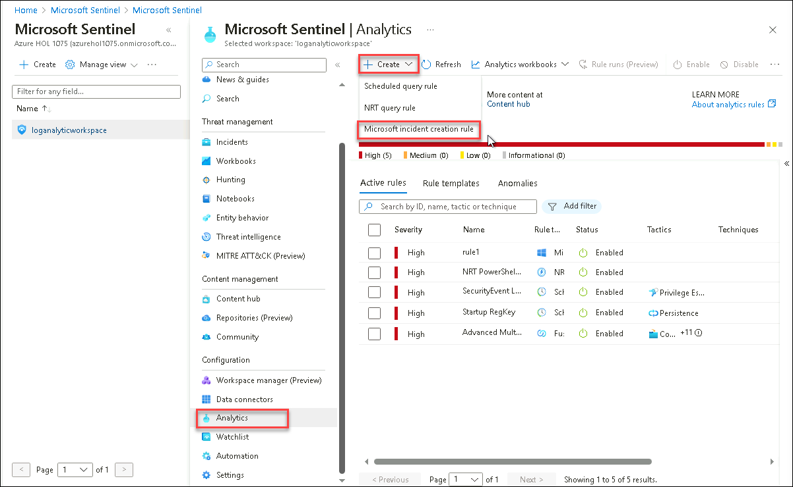

# Lab 07 - Mitigate threats using Microsoft 365 Defender 

## Lab scenario

You're a Security Operations Analyst working at a company that implemented Microsoft Defender XDR solutions. You need to see the alerts in an incident to see the incident's full impact do a root cause investigation and mitigate these alerts using M365 Defender tools.

## Lab objectives
 In this lab, you will perform the following in the M365 Defender portal:
- Task 1: Create a Group
- Task 2: Apply Microsoft Defender for Office 365 preset security policies
- Task 3: Activate a Microsoft Security Rule
- Task 4: Manage Incidents
- Task 5: Investigate Alerts

## Estimated timing: 60 minutes

## Architecture Diagram

 

### Task 1: Create a Group 

1. In the Search bar of the Azure portal, search and select **Microsoft Entra ID**.

1. Select **Groups** and then click on **New group**.

1. Enter the below details for the New group page:

   |Setting|Value|
    |---|---|
    |Group Type| **Microsoft 365** |
    |Group Name| **Sg-IT** |
    |Microsoft Entra roles can be assigned to the group| **Yes** |

1. Click on **no owners selected** and select the **ODL_user** from the list and then click on **select**.

1. Click on **no members selected** and select the **ODL_user** from the list and then click on **select**.

   **Note**: Make sure you have selected **Group type** as **Microsoft 365**.

1. Select **Create** and click on **Yes**. 

   > **Congratulations** on completing the task! Now, it's time to validate it. Here are the steps:
    > - Click the Lab Validation tab located at the upper right corner of the lab guide section and navigate to the Lab Validation tab.
    > - Hit the Validate button for the corresponding task.
    > - If you receive a success message, you can proceed to the next task. If not, carefully read the error message and retry the step, following the instructions in the lab guide.
    > - If you need any assistance, please contact us at labs-support@spektrasystems.com. We are available 24/7 to help you out.
    
### Task 2: Apply Microsoft Defender for Office 365 preset security policies

1. If you are not already at the Microsoft 365 Defender portal in your browser, go to (https://security.microsoft.com) and log in with the **Tenant Email** credentials.

1. From the navigation menu, under Email & Collaboration area, select **Policies & rules**(1) and select **Threat policies**(2).

    

1. On the Threat policies dashboard, select **Preset Security Policies**.

    

  >**Note**: If you see any popup please Close it by clicking on **X** or **Close** button.

1. Under Standard protection, select **Manage protection settings**. Hint: If you see this option grayed out, refresh your browser using Ctrl+F5.

      

   **Note:** If you encounter a pop-up prompting you to Exchange Organizational setup, wait for 5 minutes, refresh the page, and repeat the above steps again.

1. In the Apply Exchange Online Protection section, select **Specific recipients**, and under **Domains** start writing your tenant’s domain name, select it, and then select **Next**.

    

1. In the Apply Defender for Office 365 protection section, apply the same configuration as the previous step and select Next. Notice that this configuration applies policies for anti-phishing, Safe Attachments, and Safe Links.

    

1. In the Impersonation protection section, select **Next** until you reach to policy mode section.

    
     
1. In the Policy mode section, make sure the **Turn on the policy when finished** radio button is selected, and then select **Next**.

    
    
1. Read the content under Review and confirm your changes select **Confirm** to apply the changes and then select **Done** to finish.

    

1. Under Strict protection, select **Manage protection settings**. Hint: Strict protection is found under “Email & Collaboration - Policies & rules - Threat policies - Preset security policies”.

    

1. In the Apply Exchange Online Protection, select **Specific recipients** and under **Groups**, select your newly created group, and then select **Next**. Notice that this configuration applies policies for anti-spam, outbound spam filters, anti-malware, and anti-phishing.

1. In the Apply Defender for Office 365 protection section, apply the same configuration as the previous step and select Next. Notice that this configuration applies policies for anti-phishing, Safe Attachments, and Safe Links.

1. In the Impersonation protection section, select **Next** until you reach to policy mode section.

1. In the Policy mode section, make sure the **Turn on the policy when finished** radio button is selected, and then select **Next**.

    
   
1. Read the content under Review and confirm your changes select **Confirm** to apply the changes and then select **Done** to finish.

    

### Task 3: Activate a Microsoft Security Rule

In this task, you will activate a Microsoft Security rule.

1. In the Search bar of the Azure portal, type *Sentinel*, then select **Microsoft Sentinel**.

1. Select the Microsoft Sentinel Workspace.

1. Select **Analytics** from the Configuration area. By default, you will see the *Active rules*.

1. Select the **Microsoft incident creation rule** from the dropdown + Create.

     

   >**Note**: You can choose the existing **active rule** to edit or **create** new **active rule** and then edit them by selecting the respective rule in the active rules list.

1. In the name column, provide name of your choice and in dropdown of **Microsoft security service** select the **Microsoft Defender for Cloud**.

1. Select the filter by severity button as **Custom** and select all the severity levels. Select the **Next: Automated response** button and then select **Next: Review + Create** button. and click on **Save**.

1. After creating the active rule, select it for editing. right click on rule, click the **Edit** button. 
      
1. Scroll down the page and under "Analytics rule logic - Filter by Severity", select the *Custom* drop-down list.

1. Unselect **Low** for the severity level and go back to the rule.

1. Select the **Next: Automated response** button and then select **Next: Review** button.

1. Review the changes made and select the **Save** button. The Analytics rule will be saved.

1. Onboard the **s2vm-<inject key="DeploymentID" enableCopy="false"** using device onboard using the microsoft defender endpoint onboarding portal.

   >**Note**: You can refer the **Lab01 > Task 3** to onboard the device to Microsoft Defender.

### Task 4: Manage Incidents

In this task, you will manage the incidents in the M365 Defender portal.

1. If you are not already at the Microsoft 365 Defender portal in your Microsoft Edge browser, go to (https://security.microsoft.com). 

1. In the **Sign in** dialog box, copy and paste * Email/Username: <inject key="AzureAdUserEmail"></inject> and then select Next.

1. In the **Enter password** dialog box, copy and paste * Password: <inject key="AzureAdUserPassword"></inject> and then select **Sign in**.

1. From the sidebar menu, under **Incidents and Alerts**, select **Incidents**. Click on the incident **[Test Alert] Suspicious Powershell commandline on one endpoint**.

1. To manage an incident, click on back to incident details and click on **Manage Incident** to edit the details of this incident. don't make any change only review the details

1. Here, you can edit the name of the incident, add tags, assign it to an existing group or a user, change the status, classify the incident as required, and even add comments.

   

1. In the incident, the **Attack Story** tab provides a summary of the alerts and the incident graph on how these alerts are mapped.

1. You can further investigate these alerts by navigating to the **Alerts** tab.

1. You can also see the devices and users affected by this incident in the **Assets** tab. You can verify that the affected device is **s2vm-<inject key="DeploymentID" enableCopy="false" />** and the user is **demouser**.

1. The **Evidence & Responses** tab shows the initial evidence investigated by Microsoft Defender which includes the processes, IP addresses.

1. The **Summary** tab gives us a summarized report of the incident including active alerts & their category, incident information, scope, and much more.

### Task 5: Investigate Alerts

In this task, you will investigate and mitigate the alerts through recommendations by Microsoft Defender.

1. In the Microsoft Defender portal, navigate to the **Alerts** tab from the sidebar menu.

1. You can click on the alerts to view the full details. Click on the alert named **Suspicious System Network Configuration Discovery**.

1. Click on **Maximize** to view the full alert details.

1. Click on the drop-down for the first suspicious behavior to fully investigate the root cause for this activity.

   

1. You can see that this suspicious behavior was reported when the user ran a certain command. 

1. Click on the ellipses of any of process in process tree and then select **Go Hunt**. This will redirect you to a new tab of **Advanced Hunting** where you can run the query and get the results.

   

   

1. You can also investigate the alert further by navigating back to the alerts and clicking on **Deep analysis**.

   

1. You will be redirected to a new tab. Click on **Submit** to get the detailed analyzed file.

   

1. This process will take some time, after which you can see the deep analysis of the alert and further investigate it.

   

1. Microsoft Defender also provides recommendations to mitigate the alerts. On the alert details page, click on the **Recommendations** tab to view all the recommendations.

   

## Review
In this lab, you have completed the following tasks:
- Create a Group
- Apply Microsoft Defender for Office 365 preset security policies
- Activate a Microsoft Security Rule
- Manage Incidents
- Investigate Alerts
