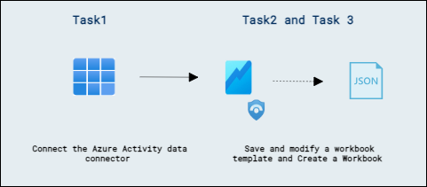
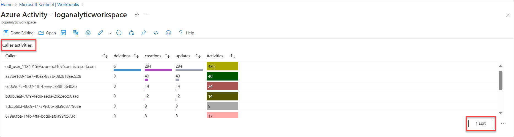
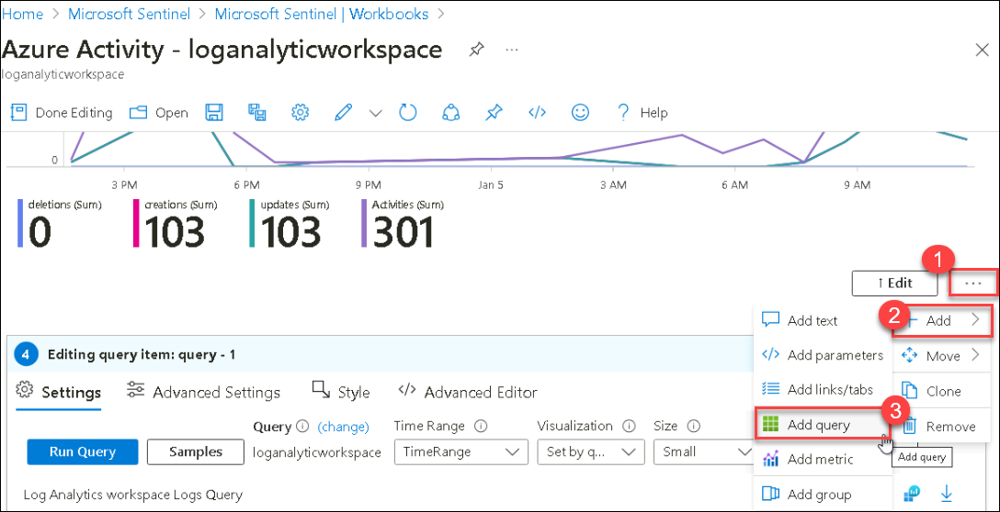
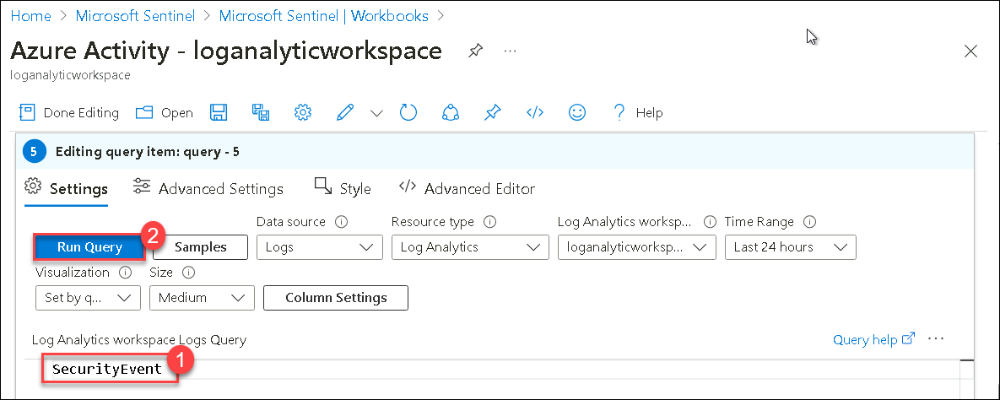
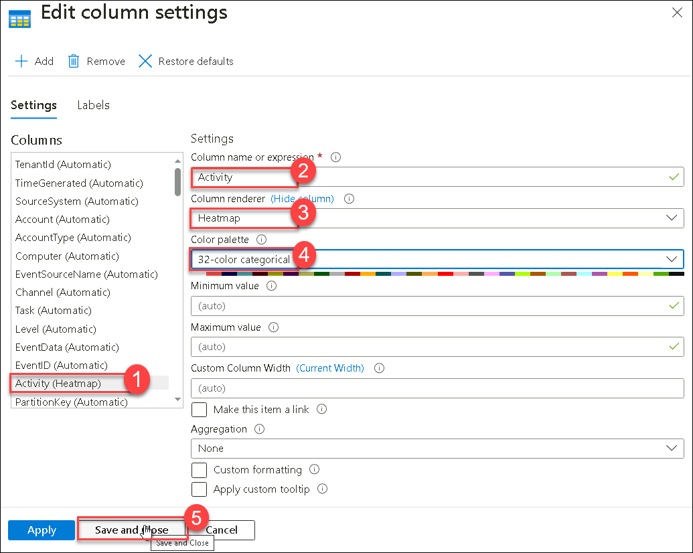
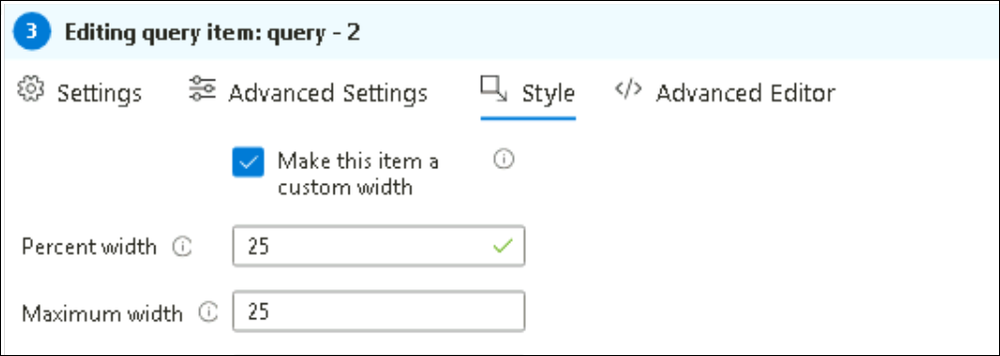
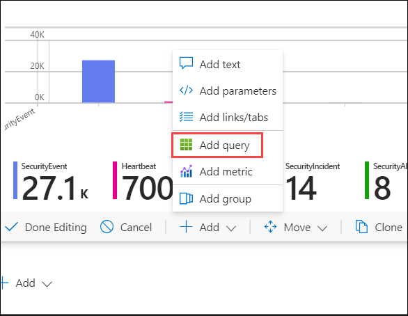

## Lab 08 - Create workbooks

## Lab scenario

You are a Security Operations Analyst working at a company that implemented Microsoft Sentinel. Once you have connected your data sources to Microsoft Sentinel, you can visualize and monitor the data using the Microsoft Sentinel adoption of Azure Monitor Workbooks, which provides versatility in creating custom dashboards. 

Microsoft Sentinel allows you to create custom workbooks across your data and also comes with built-in workbook templates to allow you to quickly gain insights across your data as soon as you connect a data source.

## Lab objectives
 In this lab, you will Understand following:
 - Task 1: Connect the Azure Activity data connector
 - Task 2: Save and modify a workbook template
 - Task 2: Create a Workbook

## Architecture Diagram

 

### Task 1: Connect the Azure Activity data connector

1. In the Microsoft Sentinel left menus, scroll down to the *Content management* section and select **Content Hub**.

1. In the *Content hub*, search for the **Azure Activity** solution and select it from the list.

1. On the *Microsoft Defender for Cloud* solution page select **Install**.

1. When the installation completes select **Manage**

    >**Note:** The *Azure Activity* solution installs the *Azure Activity* Data connector, 12 Analytic rules, 14 Hunting queries and 1 Workbook.

1. Select the *Azure Activity* Data connector and select **Open connector page**.

1. In the *Configuration* area under the *Instructions* tab, scroll down to "2. Connect your subscriptions...", and select **Launch Azure Policy Assignment Wizard>**.

1. In the **Basics** tab, select the ellipsis button (...) under **Scope** and select your "Azure Pass - Sponsorship" subscription from the drop-down list and click **Select**.

1. Select the **Parameters** tab, choose your *uniquenameDefender* workspace from the **Primary Log Analytics workspace** drop-down list. This action will apply the subscription configuration to send the information to the Log Analytics workspace.

1. Select the **Remediation** tab and select the **Create a remediation task** checkbox. This action will apply the policy to existing Azure resources.

1. Select the **Review + Create** button to review the configuration.

1. Select **Create** to finish.

1. It might take few minutes for the **Connected** status to appear.

### Task 2: Save and modify a workbook template

In this task, you will save the Microsoft Sentinel workbook templates.

1. In the Search bar of the Azure portal, type *Microsoft Sentinel*, then select **Microsoft Sentinel**.

   

1. Select your Microsoft Sentinel Workspace.

1. Select **Workbooks** under the *Threat Management* left blade.

   

1. Search and select the **Azure Activity** by navigating to templates. In the right pane, scroll down and click on the **View template** button.

 >Hint: If you don't find Azure Activity, refresh and try again. Also, if the Azure Activity status bar is not visible, click on **>>** on right corner.    

1. Review the contents of the workbook. It shows insights of your Azure subscription operations by collecting and analyzing the data from the Activity Log.

1. You should be back in the Microsoft Sentinel - Workbooks - Templates tab. Scroll down again and select the **Save** button for the Azure Activity workbook.

   

1. Leave **East US** as the default value for *Region* and select **Yes**.

1. Select the **View saved workbook** button.

   

1. Select **Edit** in the command bar to enable changes in the workbook.

1. Scroll down to the *Caller activities over time* area, look at the color of the *Activities* column since we are going to format those columns. Select the **Edit** button below the grid.  

   
   
1. Select the ellipsis (...) and select the Add query, run the **SecurityEvent**.
   
   

    

1. Select the **Column Settings** button, it is located to the right of the *Run Query* command bar. **Hint:** This button only appears if there is data from the KQL query.

1. In the *Edit column settings* blade that appears, within *Columns* select **Activities**.

1. Change the value for *Column renderer* to **Heatmap**. For *Colour palette*, scroll down to select **32-color categorical**.

1. Select **Save and Close**. Notice the change in the *Activities* column.

    

1. Select **Done Editing** at the bottom of the query (not the top menu).

1. Now select **Done Editing** at the top menu and select the **Save** icon. 

1. Close the workbook by selecting the **X** in the top-right corner.

### Task 3: Create a Workbook

In this task, you will create a new workbook with advanced visualizations.

1. You should be back at the **Workbooks** area of the Microsoft Sentinel portal.

1. Select **+ Add workbook** to create a new workbook from scratch. 

    >**Note:** Although it is a new workbook, a startup template is used.

1. To edit the workbook, select **Edit**.

1. Select the **Edit** button below the new workbook
overview of the workbook.

1. Type *# My workbook* in a new line on top of *## New workbook*.

1. Select **Done Editing** on the bottom of this section, *Editing text item: text - 2*. Notice that your header increased in size and name changed.

1. Select **Edit** below the only visible bar chart graph.

1. Review the KQL statement that provides a *union* statement of counts across all tables.

1. Scroll down and select the **Done Editing** on the bottom menu, for the *Editing query item: query - 2*.

1. Select the ellipsis **...** next to the *Edit* button of the bar chart graph, then select **+ Add**, then select **Add query**.

1. Type **SecurityEvent** into the query box.

1. Change the *Time Range* to **Last hour**.

1. Change the *Visualization* to **Time chart**.

1. Select the **Style** tab from the query's command bar.

1. Select the **Make this item a custom width** box.

1. Set the *Percent width* to **25** and *Maximum width* to **25**.

    

1. Now select **Advanced Settings** tab from the query's command bar.

1. Select **Show refresh icon when not editing** box. 

1. Scroll down and select **Done Editing** on the bottom menu, for the new *Editing query item: query - 2*.

1. Scroll down and at the bottom of the workbook select **+ Add**, then **Add query**.

    

1. Type **SecurityEvent** into the query box.

1. Change the *Time Range* to **Last hour (1)**.

1. Change the *Visualization* to **Grid (2)**.

   

1. Select **Style** from the query's command bar.

1. Select **Make this item a custom width** box.

1. Set the *Percent width* to **75** and *Maximum width* to **75**.

   

1. Scroll down and select **Done Editing** on the bottom menu, for the new *Editing query item: query - 3*.

1. Select **Done Editing** in Workbook's top command bar.

1. Select the **Save** icon, change the *Title* to **My Workbook**.

1. Select the **threadprotection-rg** resource group if needed and leave other values as default.

1.  Select **Apply** to commit the changes. 

1. Close the workbook by selecting the **X** at the top-right or select **Workbooks** in the Microsoft Sentinel portal.

1. Back in the *Workbooks* page, select the **My workbooks** tab.

1. Select the workbook you just created, **My workbook**.

1. On the right pane, select **View saved workbook** to review your workbook.

## Review
 In this lab, you will Understand following:
 - Connect the Azure Activity data connector
 - Save and modify a workbook template
 - Create a Workbook
